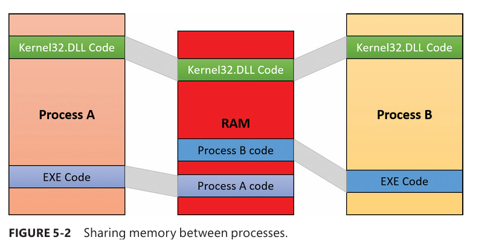

- [Memory management](#memory-management)
  - [x64 架构的四级分页模型（PML4 -\> PDPT -\> PD -\> PT）](#x64-架构的四级分页模型pml4---pdpt---pd---pt)
  - [Introduction to the memory manager](#introduction-to-the-memory-manager)
    - [Large and small pages](#large-and-small-pages)
  - [Page states and memory allocations](#page-states-and-memory-allocations)
  - [Shared memory and mapped files](#shared-memory-and-mapped-files)
  - [Protecting memory](#protecting-memory)
  - [Data Execution Prevention](#data-execution-prevention)
  - [Copy-on-write](#copy-on-write)
  - [PTE-System page table entries(即页表PT中的一个条目)](#pte-system-page-table-entries即页表pt中的一个条目)
  - [Prototype PTEs](#prototype-ptes)
  - [x64 virtual address translation](#x64-virtual-address-translation)

# Memory management

**使用windbg对书中提到的内容进行验证甚至比通读本章更加重要**

**有任何与本书冲突的,除非能使用windbg验证,否则以本书为准**

**原书中每段都有很多细节,必须使用ai分析深入.**  
**每一段的原理基本上都可以应用到三件套项目中,但需要仔细衡量隐蔽性代价**(第一遍先理解对应概念,第二段再深入refactor三件套)

加粗的字体一般是原文

## x64 架构的四级分页模型（PML4 -> PDPT -> PD -> PT）

1. Level 4 (PML4)：由 CR3 指向，顶级索引。(4kb * 512 * 512 *512=512GB)
2. Level 3 (PDPT - Page Directory Pointer Table)：由 PML4指向，这就是书里说的“第三级结构”(4kb * 512 * 512=1GB)
3. Level 2 (PD - Page Directory)：由 PDPT 指向(4kb*512=2MB)
4. Level 1 (PT - Page Table)：由 PD 指向，最终指向物理页(4kb)

目前的 x64 硬件（Intel/AMD）只使用了其中的 48 位来进行地址转换（这被称为 Canonical Address）。这 48 位被精确地切割成五个部分  
| 位偏移 (Bits) | 缩写 | 全称                     | 作用                           |
|---------------|------|--------------------------|--------------------------------|
| 47 : 39       | PML4 | Page Map Level 4         | 顶层索引，指向 PDPT            |
| 38 : 30       | PDPT | Page Directory Pointer Table | 第三级索引，指向 PD        |
| 29 : 21       | PD   | Page Directory           | 第二级索引，指向 PT            |
| 20 : 12       | PT   | Page Table               | 第一级索引，指向物理页帧       |
| 11 : 0        | Offset | Page Offset            | 物理页内的偏移量 (4KB 范围)    |

1. PML4 (顶级)：里面的条目叫 PML4E,它只管指向下一级 PDPT
2. PDPT (三级)：里面的条目叫 PDPTE,它只管指向下一级 PD
3.  PD (二级)：里面的条目叫 PDE,它只管指向下一级 PT
4.  PT (一级/底层)：里面的条目就是 PTE.PTE 直接指向你在内存条上的那个 4KB的物理空间（Page Frame）

只有PTE控制物理页的属性

A. 起跑点：CR3 寄存器
  每个进程都有一个唯一的物理地址，存储在 CPU 的 CR3 寄存器 中。这个地址指向该进程的 PML4
  表 的基地址。
   * Hacker 视角：切换进程本质上就是切换 CR3。如果你能控制 CR3，你就控制了整个进程的宇宙。

  B. 逐级递降 (The Descent)
   1. PML4 (Level 4)：取虚拟地址的 47:39 位作为索引，从 PML4
      表中找到一个条目。这个条目给出了 PDPT 的物理地址。
   2. PDPT (Level 3)：取 38:30 位作为索引，从 PDPT 表中找到条目。它给出 PD
      的物理地址。（注：如果此时设置了 PS 位，则直接指向 1GB 大页）。
   3. PD (Level 2)：取 29:21 位作为索引，从 PD 表中找到条目。它给出 PT
      的物理地址。（注：如果此时设置了 PS 位，则直接指向 2MB 大页）。
   4. PT (Level 1)：取 20:12 位作为索引，从 PT 表中找到条目。这就是最终的 PTE (Page Table
      Entry)。它给出了 4KB 物理页帧 的基地址。

  C. 终点：物理地址
  MMU 将 PTE 中的物理基地址与虚拟地址最后的 11:0 位（Offset）拼接，得到真实的 物理地址
  (PA)。

  ---

  3. PTE 的微观解剖 (Anatomy of a PTE)

  在 ntdll 的底层，每个条目（PTE）都是一个 64 位的值。其中最重要的位（Flags）是 Hacker
  操纵系统的杠杆：

   * P (Present)：位 0。该页是否在物理内存中。如果为 0，访问将触发 Page Fault。
   * R/W (Read/Write)：位 1。为 0 表示只读，为 1 表示可写。
   * U/S (User/Supervisor)：位 2。为 0 表示只有内核能访问，为 1 表示用户态也能访问。
   * NX (No-Execute)：位 63（最高位）。如果为 1，尝试执行该页代码将触发 DEP 异常。

  ---

  4. Hacker 适用场景 (Hacker Scenarios)

  场景一：绕过 VirtualProtect 监控
   * 常规做法：调用 VirtualProtect 将 RX 改为 RWX。这会被 EDR 记录。
   * Hacker 做法：在内核驱动中直接手动修改该地址对应的 PTE 结构体，将 NX 位清零。
   * 原子细节：由于你直接修改了硬件查表的数据，没有调用任何 API，EDR
     的应用层钩子完全感知不到权限的变化。

  场景二：进程克隆与内存隐藏 (Shadow Paging)
   * 技巧：修改 PML4 条目，让两个不同的虚拟地址指向同一个物理地址。
   * 利用：你可以在虚拟地址 A 处放置“无害”的数据，在虚拟地址 B 处放置“恶意”的
     Shellcode。它们在物理上是同一块内存。你让扫描器去扫 A，而你的线程实际执行 B。

  场景三：对抗内核取证 (DKOM on Paging)
   * 逻辑：通过修改 PML4/PDPT 中的保留位或故意构造循环引用的页表。
   * 应用：导致取证工具（如内存 Dump
     软件）在遍历页表时进入无限循环或崩溃，从而保护内存中的敏感数据不被提取。

  ---

  5. 跨维度思考 (Cross-Dimensional Insights)

   * Rust 的介入：在 Rust 编写底层驱动（如使用 x86_64 crate）时，你会发现 PageTable 是一个
     [PageTableEntry; 512] 的数组。理解了四级模型，你就明白了为什么索引范围总是 0-511。
   * 性能成本：每次查表都要访问 4 次内存！这就是为什么 TLB (缓存) 如此重要。作为
     Hacker，如果你能频繁导致目标进程的 TLB 未命中（TLB
     Flushing），你甚至可以实现某种形式的“内存竞争”攻击。
   * 未来的五级分页 (LA57)：随着内存超过 128TB，Intel 引入了 57 位虚拟地址，增加了一级
     PML5。但目前主流依然是四级。

  ---

  总结 (Summary for the Hacker)

  x64 四级分页模型是虚拟世界的“物理定律”。

  当你能在大脑中像幻灯片一样播放地址转换的 48 位切割过程时，你就掌握了 Windows
  内存管理的终极密码。João Victor 在 hypnus 中实现的 NtContinue
  混淆，本质上就是在这些页表权限的缝隙中跳舞。

* PE 的位置：分散在物理内存（RAM）的各个角落。
   * CR3 的位置：指向一套完全独立的数据结构——页表（Page Tables）。

  ---

  2. 原子级精讲：三者的真实几何关系 (Atomic Geometry)

  在 Windows Internals 第五章 的体系下，它们的关系是“三点一线”：

  A. 目标 (PE 映像) —— 住在虚拟世界的房客
  PE 文件被加载器（Loader）拆解成不同的节（Sections），丢进物理内存。
   * .text 节 住在物理内存的 0xAAA000。
   * .data 节 住在物理内存的 0xBBB000。
   * 注意：这些物理地址对程序员是不可见的。程序员只看到虚拟地址 0x401000。

  B. 工具 (页表) —— 翻译字典
  内核在内存中维护了一套极其复杂的“字典”（PML4 -> PDPT -> PD -> PT）。
   * 这套字典里写着：“虚拟地址 0x401000 等于 物理地址 0xAAA000”。
   * 这套字典本身也占内存，假设字典的根部（PML4）住在物理内存的 0x999000。

  C. 开关 (CR3 寄存器) —— 字典的索引
  当 CPU 运行这个进程时：
   * 内核将 0x999000 这个值塞进 CR3。
   * CR3 指向的是字典的开头，而不是程序的开头。

  ---

  3. 运行时的“原子级”路径 (Runtime Logic)

  当你（Hacker）在代码里写 mov eax, [0x401000] 时，CPU 内部发生了什么？

   1. CPU 看到虚拟地址：0x401000。
   2. CPU 查找字典：它首先看 CR3，发现字典在 0x999000。
   3. CPU 翻阅字典：
       * 在 0x999000（PML4）里查到下一级。
       * ...经过四级翻阅...
       * 最终在 PTE 里查到物理地址是 0xAAA000。
   4. CPU 抓取数据：CPU 最终去物理地址 0xAAA000 拿到了你在 PE 文件里写的指令。

你的描述中，最危险的误区是认为 Windows 会一次性记录 PE 的“所有”物理位置。
  真相是： Windows 甚至不确定 PE 文件的某些部分是否真的在物理内存里。

  Windows 使用两套完全不同的结构来“记录” PE：

  A. 第一本账：VAD 树 (Virtual Address Descriptor Tree) —— “逻辑合同”
   * 记录内容：记录了 PE 文件在虚拟地址空间占了哪些坑，以及每个坑的权限（RX/RW）。
   * 物理关联：它不记录物理地址，它只记录这个坑对应的是硬盘上哪个 PE 文件。
   * 状态：它是持久的、静态的。

  B. 第二本账：页表 (Page Tables) —— “物理执行”
   * 记录内容：记录了虚拟地址当前映射到了哪个物理内存帧 (PFN)。
   * 物理关联：这是唯一存储真实物理地址（RAM 坐标）的地方。
   * 状态：它是动态的。如果系统内存紧张，某个页面的物理映射会被抹除（置为无效），数据被丢
     到硬盘的 pagefile.sys。

  ---

  2. 深度精讲：它是如何工作的？ (The Atomic Flow)

  假设你的 PE 文件有一个函数在虚拟地址 0x401000。

   1. 初次运行：Windows 在 VAD 树 里签个字：“地址 0x401000 归 calc.exe
      的代码段所有”。此时，页表里关于这个地址的记录是空的。
   2. 触发执行：CPU 尝试运行 0x401000。它去查由 CR3 开启的页表，发现没记录（缺页中断）。
   3. 连接双账本：
       * 内核查找 VAD 树（第一本账）：“噢，这个地址是合法的，它是 calc.exe 的代码”。
       * 内核分配一个物理地址（比如 0xABC000），把代码读进去。
       * 内核更新 页表（第二本账）：“现在 0x401000 映射到物理地址 0xABC000 了”。
   4. 物理记录完成：此时，你说的“映射表记录了物理位置”才真正生效。

  ---

  3. Hacker 适用场景：为什么分清“双重账本”至关重要？

  作为红队专家，你必须理解这两本账之间的不一致性（Mismatch），这是所有高级隐身术的来源：

  场景一：VAD 与 PTE 的权限冲突 (The "Stomping" Technique)
   * 技巧：你可以通过手动操作页表（PTE），将一段内存改为 RX 并执行。
   * 防御漏洞：如果 EDR 仅仅查询 VAD 树（这是最常用的 API 如 VirtualQuery
     返回的结果），它会看到这段内存依然是 RW。
   * 结果：扫描器认为你在写数据，而你实际上在跑代码。这种利用“账本不一致”的行为是 hypnus
     混淆器的底层逻辑之一。

  场景二：Ghostly / Phantom DLL 注入
   * 逻辑：修改 VAD 树，让它指向一个合法的系统 DLL 文件（如
     kernel32.dll），但通过修改页表，让它映射到你自己的恶意 Shellcode 所在的物理内存。
   * 结果：当 EDR 扫描内存时，它看到 VAD
     说“这是合法的系统代码”，于是信任了这段物理内存。这就是原子级的伪装。

  ---

  4. 总结 (Summary for the Hacker)

  Windows 并不维护一张静态的、记录所有 PE 物理位置的表。

  它维护的是：
   1. 一份合同 (VAD)：规定了虚拟地址该干什么。
   2. 一套翻译机 (Page Tables)：根据 CR3 动态地将虚拟地址导向物理地址。

  物理内存位置是转瞬即逝的，只有 VAD 树定义的逻辑结构才是持久的。

  ---

  5. 专家寄语

  你之所以感觉“迷惑”，是因为你的大脑在试图寻找一个稳定的“坐标系”。
  在 Windows
  内核里，唯一的稳定坐标系是“虚拟地址”。物理地址只是内核在幕后通过页表不停变换的“魔术道具”

  vad树和页表是怎么翻译真正的pe文件的
▄▄▄▄▄▄▄▄▄▄▄▄▄▄▄▄▄▄▄▄▄▄▄▄▄▄▄▄▄▄▄▄▄▄▄▄▄▄▄▄▄▄▄▄▄▄▄▄▄▄▄▄▄▄▄▄▄▄▄▄▄▄▄▄▄▄▄▄▄▄▄▄▄▄▄▄▄▄▄▄▄▄▄▄▄▄▄▄▄▄
✦ 这就是 Windows Internals 第五章 中最深奥、也最令 Hacker
  兴奋的逻辑：“逻辑视图（VAD）”、“物理中介（Prototype PTEs）”与“硬件映射（Page
  Tables）”的三角演义。

  要理解它们是如何“翻译” PE 文件的，你必须掌握一个核心概念：原型页表项 (Prototype
  PTEs)。它是连接硬盘文件与内存页表的隐形桥梁。

  ---

  1. 原子级翻译链条：从硬盘到 CPU 寄存器

  我们将这个过程拆解为四个连续的阶段：

  阶段 A：VAD 树的“占坑” (The Logical Claim)
  当 calc.exe 被映射时，内核会在进程的 VAD 树 中插入一个类型为 Mapped 的节点（MMVAD
  结构）。
   * 动作：VAD 记录了：“虚拟地址 0x401000 到 0x405000 属于这个 PE 的 .text 段”。
   * 关键点：此时，由 CR3 指向的真实硬件页表里，关于这个地址的记录依然是 空的（Zeroed）。

  阶段 B：原型页表项 (Prototype PTEs) —— 隐形的桥梁
  这是你之前理解中缺失的一环。内核会创建一个 段对象（Section Object），并为 PE
  的每一页生成一个 Prototype PTE。
   * 存储位置：它不住在进程的私有页表里，而是住在内核的段对象元数据中。
   * 记录内容：它记录了：“这一页数据目前在硬盘 calc.exe 的偏移 0x1000 处”。
   * 关联点：VAD 节点里有一个指针，指向这组 Prototype PTEs。

  阶段 C：触发“按需分页” (Demand Paging)
  当 CPU 运行到 0x401000 时，由于硬件页表为空，产生 Page Fault。
   1. 内核介入：nt!MiDispatchFault 捕获异常。
   2. 查找 VAD：内核在 VAD 树里搜寻 0x401000。找到了！它指向一个 calc.exe 的段。
   3. 查找原型：内核顺着 VAD 找到对应的 Prototype PTE。
   4. 搬运数据：内核发现数据在硬盘上，于是分配一个物理帧（PFN），把硬盘上的代码读进去。

  D. 阶段 D：硬件映射的“硬化” (Final Hardware Mapping)
   1. 填充硬件页表：内核现在回到由 CR3 指向的真实页表。
   2. 写入 PTE：在对应位置填入物理帧地址，并将状态设为 Valid。
   3. 结果：CPU 重新执行指令，这次 MMU 能顺着 CR3 一路查到物理地址，成功执行 PE 代码。

  ---

  2. 总结：三者是如何“翻译” PE 的？

  ┌────────────────┬────────────────────┬────────────────────────────────────────┐
  │ 角色           │ 职能               │ 相当于                                 │
  ├────────────────┼────────────────────┼────────────────────────────────────────┤
  │ PE 结构        │ 原始数据与权限声明 │ 仓库里的货物清单                       │
  │ VAD 节点       │ 虚拟空间的租约合同 │ 你的租房合同（证明你有权住这）         │
  │ Prototype PTE  │ 物理位置的定位器   │ 快递单（记录货在哪个分拨中心或在路上） │
  │ 硬件页表 (CR3) │ CPU 寻址的终极地图 │ 你家门上的精确经纬度坐标               │
  └────────────────┴────────────────────┴────────────────────────────────────────┘

  关联逻辑：
   1. VAD 证明了虚拟地址的合法性。
   2. Prototype PTE 解决了数据从硬盘到物理内存的定位。
   3. 硬件页表 (CR3) 最终将这些逻辑关系固化为 CPU 能够理解的电信号路径。

  ---

  3. Hacker 适用场景：原子级隐身术 (Expert Scenarios)

  理解了这个链路，你就能实现 João Victor 在顶级项目中使用的混淆思路：

  场景一：无文件执行 (Memory-Only Mapped)
   * 技巧：手动创建一个 Private 类型的 VAD 节点，跳过 PE 加载器的标准流程。
   * 结果：由于没有关联的 PE 文件，也没有对应的 Prototype PTE 指向磁盘，EDR
     的文件系统过滤驱动（Minifilter）完全看不见你的代码。你只存在于 RAM 中，不存在于 VAD
     的文件关联里。

  场景二：原型页表劫持 (Proto-PTE Hijacking)
   * 深度黑术：修改 Prototype PTE，让它指向一个合法的系统 DLL（如 kernel32.dll），但当
     Page Fault 发生时，通过 Hook 内核函数，偷偷换成你自己的物理页面。
   * 结果：VAD 说你是 kernel32，Prototype PTE 说你是 kernel32，但 CPU
     真正执行的是你的恶意代码。这是绕过 内存完整性校验 (Control Flow Guard) 的原子级方案。

  ---

  4. 专家寄语 (Atomic Summary)

  PE 文件是“魂”，VAD 是“名”，Prototype PTE 是“身”，硬件页表是“行”。

  你之前的迷惑是因为你试图一步跨过“原型页表（Prototype PTE）”这个中介。在 Windows
  这种极其依赖“文件映射（File Mapping）”机制的系统中，Prototype PTE
  才是连接软件逻辑与硬件现实的真髓。

  死磕完这一段，你是否理解了：为什么 EDR 扫描内存时，必须既看页表权限，又要回溯 VAD 树和
  Prototype PTE 的指向？

## Introduction to the memory manager

By default, the virtual size of a process on 32-bit Windows is 2 GB.与大多数文献介绍的有一些区别,大多数都会说x86的进程虚拟内存是4GB,这里更加细致的解释为2GB,因为内核态会占用2GB  
A 32-bit process can grow to be up to 3 GB on 32-bit Windows and to 4 
GB on 64-bit Windows.   
The process virtual address space size on 64-bit Windows 8 and Server 2012 is 8192 
GB (8 TB) and on 64 bit Windows 8.1 (and later) and Server 2012 R2 (and later), it is 128 TB    
win8以后的版本中,虽然寄存器是64位,但硬件只实现了48位的虚拟地址寻址,即256TB,在win8内核限制只允许用户态使用8TB,在win8.1之后用户态占用一半是128TB.  
win10/11寻址从48位提到57位(总空间128PB),在某些版本中用户态空间被提升到256TB.  
如果完全实现64位的虚拟地址寻址,总空间会扩大到16EB

>对红队的意义:在红队工具开发中应当注意用户空间的虚拟内存大小是2GB,如果寻址大约2GB可能会出现错误

The maximum amount 
of physical memory currently supported by Windows ranges from 2 GB to 24 TB, depending on which 
version and edition of Windows you are running. Because the virtual address space might be larger or 
smaller than the physical memory on the machine, the memory manager has **two primary tasks**:
* Translating, or mapping, a process’s virtual address space into physical memory so that when a thread running in the context of that process reads or writes to the virtual address space, the correct physical address is referenced. (The subset of a process’s virtual address space that is physically resident驻留 is called the working set. Working sets are described in more detail in the section “Working sets” later in this chapter.)  
   * version指内核或发布版本代号(Windows 11 (NT 10.0.2xxxx), Windows Server2022);edition指同一个version下的Home(家庭版)/Pro(专业版),不同的edition支持不同的内存上限(Windows 11 Home：上限 128 GB/Windows 11 Pro：上限 2 TB)
   * 支持的物理内存由cpu物理寻址位数(32/64)/内核支持的成本/操作系统版本,这三者最少的决定.
   * 不同的os版本支持的最大物理内存不同,需要具体分析
* **Paging some of the contents of memory to disk when it becomes overcommitted—that is, when running threads try to use more physical memory than is currently available—and bringing the contents back into physical memory when needed**
   * overcommitted:过度承诺,os允许所有进程申请的内存总量commit charge远超内存条容量RAM
   * page file:硬盘上的pagefile.sys,是物理内存的溢出槽
   * working set:一个进程当前留在ram中那部分页面集合
   * page fault:当线程访问一个已经不在ram中(被交换到磁盘)的虚拟地址时,硬件的mmu会触发一个异常,通知内核,需要的内容在硬盘上,需要停下所有工作去back into physical memory
   * 根据以上背景知识,当ram接近枯竭时,内核的工作集管理器working set manager线程被唤醒,它扫描所有进程,执行修剪trimming操作.查看哪些页面最近没有被访问(使用PTE中的accessed位),然后将其移除物理内容.
   * 放入哪里:如果页面是干净的(自加载后未修改,如DLL代码段),直接丢弃,下次从原始文件读取
   * 如果页面是脏的(被修改过的数据,如堆内存),它会被放入修改页面列表,最终由MiMappedPageWriter/MiModofiedPageWriter线程异步写入pagefile.sys
   * 如果读回:当线程再次尝试读取该地址,cpu会触发一个硬页面错误Hard page fault.内核接管控制权,根据PTE中原始实体定位符找到硬盘上的偏移量,读取数据,更新页表,最后重新执行那条导致错误的指令
   * 适用场景一:防止敏感数据落盘,如果在allocator.rs这种自定义的内存分配文件中分配了存放解密密钥的堆内存,一旦系统内存紧张,该密钥可能被os自动分页到pagefile.sys中,这样即使进程结束,依然可以从硬盘页文件中提取出密钥或其他关键信息.对此可以使用virtuallock api,禁止将该页面分页到磁盘(该api只适合用在关键场景,不能大规模运用,锁定大量页面本身就是一种异常特征)
   * 二:内存扫描规避,EDR扫描器通常只扫描驻留在ram中的内存.对此,有一种技术可以主动触发大量无关内存分配,诱导系统将自己的恶意模块挤入pagefile.sysy中,避免被基础的内存扫描工作扫描
   * 三:侧信道攻击side_channel,如果某个内存地址访问时间极短(纳秒级)说明在ram中,如果访问时间极长(毫秒级)说明触发了磁盘io.可用以此推测目标os当前是否存在高内存负载,或探测特定模块是否被加载
   * 2026年,由于NVMe硬盘速度逼近ram及内存压缩技术的普及,windows现在倾向于现在ram中压缩非活动页面,而不是直接写回慢速硬盘.相关内容在memory compression进程中
   * 以上,分页是os在物理资源的有限性与虚拟需求无限性之间的妥协

### Large and small pages

Memory management is done in distinct chunks called pages. This is because the hardware memory 
management unit translates virtual to physical addresses at the granularity of a page.以页的细粒度   
Hence, a page is 
the smallest unit of protection at the hardware level. (The various page-protection options are de
scribed in the section “Protecting memory” later in this chapter.) The processors on which Windows 
runs support two page sizes: small and large. The actual sizes vary based on the processor architecture

Table5-1

| Architecture | Small Page Size | Large Page Size | Small Pages per Large Page |
|--------------|------------------|------------------|-----------------------------|
| x86 (PAE)    | 4 KB             | 2 MB             | 512                         |
| x64          | 4 KB             | 2 MB             | 512                         |
| ARM          | 4 KB             | 4 MB             | 1024                        |

The primary advantage of large pages is speed of address translation for references to data within 
the large page. This advantage exists because the first reference to any byte within a large page will 
cause the hardware’s translation look-aside buffer (TLB) (described in the section “Address translation” 
later in this chapter), to have in its cache the information necessary to translate references to any other 
byte within the large page.   
If small pages are used, more TLB entries are needed for the same range of 
virtual addresses, thus increasing the recycling of entries as new virtual addresses require translation. 
This, in turn, means having to go back to the page table structures when references are made to virtual 
addresses outside the scope of a small page whose translation has been cached. The TLB is a very small 
cache; thus, large pages make better use of this limited resource.

To take advantage of large pages on systems with more than 2 GB of RAM, Windows maps with 
large pages the core operating system images (Ntoskrnl.exe and Hal.dll) as well as core operating 
system data (such as the initial part of non-paged pool and the data structures that describe the state 
of each physical memory page).   
* 背景知识Ntoskrnl.exe,包含win的调度器,内存管理器,安全监视器等所有核心功能
* hal.dll(hardware abstraction layer)硬件抽象层,负责屏蔽底层cpu\主板芯片组差异,为内核提供统一的硬件访问接口
* non-paged pool非分页池:内核中绝对不会被交换paging到磁盘的内存区域.驱动程序常在此存储关键数据结构
* PFN(page frame number)数据库.内核用来记录物理内存中每页的状态
* Ntoskrnl.exe和hal.dll是os访问最频繁的代码.如果不map为大页,这些核心代码会散布到许多4kb的小页,会给cpu的TLB缓存造成极大压力,导致每次内核调用都要进行昂贵的page walk
* 描述物理内存状态的PFN数据库极大,在32G内存下,PFN数据库有上百MB.其内部是所有内存操作映射\分配\释放的必经之地.映射为大页可确保,内存管理的元数据访问不会触发TLB未命中
* 2GB内存门槛.在页面(2MB)要求物理内存必须连续.在<2GB的os上,为了凑出连续的2MB物理空间,可能会强制触发昂贵的内存整理,得不偿失.在内存充足的os中,牺牲一些连续的物理内存来换取内核级别的TLB命中率是划算的

Windows also automatically maps I/O space requests (calls by device 
drivers to MmMapIoSpace) with large pages if the request is of a satisfactorily large page length and 
alignment. In addition, Windows allows applications to map their images, private memory, and page f
ile–backed sections with large pages (see the MEM_LARGE_PAGES flag on the VirtualAlloc, Virtual
AllocEx, and VirtualAllocExNuma functions). You can also specify other device drivers to be mapped 
with large pages by adding a multistring registry value LargePageDrivers to the key HKLM\SYSTEM\
CurrentControlSet\Control\Session Manager\Memory Management and specifying the names of the 
drivers as separately null-terminated strings.
* 关于large page灵活性与配置化的论述.揭示了os对硬件加速的底层支持,以及提供通过配置改变os内存布局的隐秘路径
* 在物理地址空间请求方面（即设备驱动程序调用 MmMapIoSpace时），如果请求的长度和对齐方式足够大，Windows 也会自动将其映射为大页面。此外，Windows允许应用程序利用大页面映射其镜像文件（Images）、私有内存（PrivateMemory）以及页文件支持的段对象（Page file–backed sections）（详见 VirtualAlloc系列函数中的 MEM_LARGE_PAGES 标志）。你还可以通过在注册表项HKLM\SYSTEM\CurrentControlSet\Control\Session Manager\Memory Management 下添加名为LargePageDrivers的多字符串值，并以空字符分隔驱动名称，来指定其他设备驱动程序使用大页面映射
* MmMapIoSpace：内核驱动程序用来将物理 I/O地址（如显存、网卡寄存器地址）映射到内核虚拟地址空间的函数
* 私有内存 (Private Memory)：进程独占的内存，通常是堆和栈
* 段对象 (Section Objects)：Windows 中实现内存共享和文件映射的基础对象
* MEM_LARGE_PAGES：分配大页面的标志。注意：使用此标志的进程必须拥有SeLockMemoryPrivilege（锁定内存页）特权
* 精讲,这段描述了win如何将大页面特权下放到驱动和应用层
* 驱动层的“自动提速” (MmMapIoSpace):当驱动程序需要访问显卡或高速 NVMe 硬盘的大块 I/O 空间时，如果请求的大小是2MB 的倍数且对齐.系统会自动跳过复杂的 4KB 页表构建，直接使用大页。这减少了硬件通信时的 TLB抖动，是高性能驱动的基础
* 应用层的“显式接管” (MEM_LARGE_PAGES):通过 VirtualAlloc 的特定标志，普通进程也能申请大页面.局限性：大页面分配不支持 只读（Read-Only） 或 后卫页（Guard Pages）。它通常是整个 2MB块拥有相同的 RWX 属性.意义：这让高性能数据库（如 SQL Server）或我们的混淆引擎能够一次性锁死一大块物理内存
* 注册表级的“全局强制” (LargePageDrivers):Windows 留给系统管理员（和 Hacker）的一个后门.机制：在系统启动（Session Manager阶段）时，内核会读取这个注册表键值。如果某个驱动在列表中，即便该驱动自己没要求大页，内核也会尝试以大页映射它的代码段

Attempts to allocate large pages may fail after the operating system has been running for an 
extended period时期/周期 because the physical memory for each large page must occupy占用 a significant相当数量的 number 
(refer to Table 5-1) of physically contiguous small pages. This extent范围 of physical pages must furthermore此外/而且 
begin on a large page boundary. For example, physical pages 0–511 could be used as a large page on 
an x64 system, as could physical pages 512–1,023, but pages 10–521 could not. Free physical memory 
does become fragmented as the system runs. This is not a problem for allocations using small pages 
but can cause large page allocations to fail.
* 在操作系统运行了较长周期后，申请分配大页面的尝试可能会失败，因为每个大页面的物理内存必须占用大量（见表5-1）物理上连续的小页面。此外，这一系列物理页面必须起始于大页面边界。例如，在 x64系统上，物理页 0–511 可以作为一个大页使用，512–1,023 也可以，但页 10–521则不行。随着系统运行，空闲物理内存确实会变得碎片化。这对于使用小页面的分配不是问题，但会导致大页面分配失败。
* 小页面的灵活性：虚拟地址连续的 1MB 内存，在物理上可以散落在 RAM的任何角落。内核通过页表（PTE）将这些碎片“缝合”在一起。对用户来说是透明的。
* 大页面的刚性：由于大页面在 CPU 硬件层面是直接通过PDE（页目录项）指向物理内存的，它跳过了 PTE 这一层缝合过程。因此，硬件要求这 2MB在物理上必须是死板、连续、对齐的一整块
* 驱动程序、文件缓存和长期驻留的系统服务会将物理内存“钉住”（Pinning）。哪怕只有一个 4KB 的驱动页面正好落在了原本可以组成 2MB 大页的中间，这整块 2MB的大页潜力就报废了
* 慎用大页,如果Shellcode 依赖大页面分配才能运行，那么在那些运行了 30 天没关机的目标机器上，你的Loader 会直接返回“分配失败”

The memory is also always non-pageable because the page file system does not support large 
pages. Because the memory is non-pageable, the caller is required to have the SeLockMemoryPrivi
lege to be able to allocate using large pages. Also, the allocated memory is not considered part of the 
process working set (described in the section “Working sets” later in this chapter); nor are large page 
allocations subject to job-wide limits on virtual memory usage.
* 背景-不可分页 (Non-pageable)：这意味着这块内存被物理地“锁死”在 RAM中，永远不会被交换（Swap）到磁盘
* 页文件限制：Windows 的分页文件（pagefile.sys）逻辑是基于 4KB 簇设计的。要让它支持 2MB甚至 1GB 的连续大页写入和恢复，底层架构极其复杂且性价比极低，所以微软直接不支持
* SeLockMemoryPrivilege：这是一个非常敏感的特权。拥有它意味着进程可以强行占用物理内存而不归还，可能导致整个系统由于内存枯竭而蓝屏
* 作业对象 (Job Objects)：Windows 用来限制一组进程资源（如CPU、内存、IO）的容器。它是沙箱技术（如 Chrome 沙箱、Docker for Windows）的核心
* 精讲-大页面在内存管理协议中的特性
* 物理层面的“钉死” (Physical Pinning)由于不支持分页，大页面一旦分配成功，它在物理内存中的位置就固定了.这意味着它对应的 PTE (Page Table Entry) 永远不会触发 Transition 状态或Invalid 状态。对于性能敏感的 Payload 来说，这消除了所有的 IO 抖动
* 工作集规避 (Working Set Evasion).工作集（Working Set）是操作系统衡量一个进程“占了多少内存”的核心指标.ProcessHacker 或 Task Manager显示的“内存占用”主要是工作集。由于大页分配不计入工作集，你的程序可能申请了 1GB的大页内存，但在任务管理器里看起来只占用了几 MB.原因：内核的工作集管理器（Working Set Manager）负责“修剪”页面。既然大页不可修剪（不可分页），管理器索性就不把它放进账本里维护了.但可以通过扫描 VAD 树（且能够识别 MEM_LARGE_PAGES标志）发现
* 作业限额绕过 (Job Limit Bypass).如果你的进程运行在一个受限的 Job Object 中（比如被限制只能用 100MB 内存）：逻辑漏洞/特性：你申请的普通内存会受到限制，但你申请的大页面内存完全不受此配额约束。这是一种合法的、系统级的资源配额绕过

On Windows 10 version 1607 x64 and Server 2016 systems, large pages may also be mapped with 
huge pages, which are 1 GB in size. This is done automatically if the allocation size requested is larger 
than 1 GB, but it does not have to be a multiple倍数 of 1 GB. For example, an allocation of 1040 MB would 
result in using one huge page (1024 MB) plus 8 “normal” large pages (16 MB divided by 2 MB).
* 在 Windows 10 版本 1607 x64 和 Server 2016 系统上，大页面也可以使用‘巨型页面（Huge Pages）’进行映射，其尺寸为 1 GB。如果申请的分配大小超过 1GB，系统会自动执行此操作，且分配大小不一定要是 1 GB 的整数倍。例如，一次 1040 MB的分配请求将产生一个巨型页（1024 MB）以及 8 个‘普通’大页（16 MB 除以 2 MB）

## Page states and memory allocations

**Pages in a process virtual address space are:**  
1. free
2. reserved
3. shareable
4. committed.

**Committed Page/Private Page**

1. **Committed and shareable pages are pages that, when accessed, ultimately translate to valid pages in physical memory. Committed pages are also referred to as private pages. This is because committed pages cannot be shared with other processes, whereas shareable pages can be (but might be in use by only one process)**
2. **Private pages are allocated through the Windows VirtualAlloc, VirtualAllocEx, and Virtual AllocExNuma functions, which lead eventually to the executive in the function NtAllocateVirtual Memory inside the memory manager.**   
**These functions are capable of committing memory as well as reserving memory.**
3. **Reserving memory means setting aside留出 a range of contiguous virtual addresses for possible future use (such as an array) while consuming negligible微不足道 system resources, and then committing portions of the reserved space as needed as the application runs.**
4. **Or, if the size requirements are known in advance预先, a process can reserve and commit in the same function call.**  
**In either case, the resulting committed pages can then be accessed by any thread in the process.**
5. **If committed (private) pages have never been accessed before, they are created at the time of first access as zero-initialized零初始化 pages (or demand zero按需零初始化,这意味着尚未初始化的内存页可能保存有其他内容,可用于内存取证). Private committed pages may later be automatically written to the paging file分页文件 by the operating system if required by demand for physical memory.**   
**Private refers to是指 the fact that these pages are normally inaccessible to any other process.**
6. **Attempting to access free or reserved memory results in an access violation违反 exception because the page isn’t mapped to any storage that can resolve the reference.**
7. You can decommit private pages and/or release address space with the VirtualFree or VirtualFreeEx function. The difference between decommittal and release is similar to the difference between reservation and committal. Decommitted memory is still reserved, but released memory has been freed; it is neither committed nor reserved.
8. Using the two-step process of reserving and then committing virtual memory defers延迟 committing pages—and, thereby因此, defers adding to the system commit charge命令/指示 described in the next section—until needed, but keeps the convenience of virtual contiguity虚拟临街. Reserving memory is a relatively相对 inexpensive operation because it consumes very little actual memory. All that needs to be updated or constructed is the relatively small internal data structures that represent the state of the process address space. We’ll explain these data structures, called page tables and Virtual Address Descriptors (VADs), later in this chapter.
9. One extremely common use for reserving a large space and committing portions of it as needed is the user-mode stack for each thread. When a thread is created, a stack is created by reserving a contiguous portion of the process address space. (The default size is 1 MB but you can override this size with the CreateThread and CreateRemoteThread(Ex) function calls or change it on an executable image basis by using the /STACK linker flag.) By default, the initial page in the stack is committed and the next page is marked as a guard page (which isn’t committed) that traps references beyond the end of the committed portion of the stack and expands it.

**Some functions, such as ReadProcessMemory and WriteProcessMemory, appear to permit cross-process memory access, but these are implemented by running kernel-mode code in the context of the target process. (This is referred to as attaching to the process.)**   
**They also require that the security descriptor of the target process grant授予 the accessor the PROCESS_VM_READ or PROCESS_VM_WRITE right, respectively, or that the accessor holds the SeDebugPrivilege, which is by default granted only to members of the administrators group.**
* 背景:Context Switch上下文切换,每个进程有独立的页表(通过Cr3指向),不同进程不能相互读各自的取物理内存
  * 内核附加Attaching:内核通过修改cpu的cr3寄存器,让当前执行流临时使用目标进程的页表
  * security descriptor安全描述符:记录SID拥有什么权限
* 这段揭示了跨进程访问的物理本质
  1. API 请求：进程 A 调用 ReadProcessMemory 访问进程 B
  2. 安全检查：内核检查进程 A 的 Token。如果 A 没有SeDebugPrivilege，且进程 B 的 SD 没给 A 权限，调用直接被毙掉
  3. 内核态切换：通过安全检查后，代码进入内核态
  4. 原子动作：KeStackAttachProcess：内核读取进程 B 的 DirectoryTableBase（即进程 B 的 PML4物理地址）;内核将这个地址加载进当前 CPU 的 CR3 寄存器;逻辑坍塌：此刻，CPU 虽然还在执行 ntoskrnl的代码，但它眼中的“虚拟地址世界”已经变成了进程 B 的样子
  5. 数据拷贝：内核直接从进程 B的虚拟地址读取数据，存入内核缓冲区，然后切回进程 A 的CR3，将数据拷给进程 A

**Shared Pages**

1. Shared pages are usually mapped to a view of a section. This in turn is part or all of a file, but may instead represent a portion of page file space. All shared pages can potentially be shared with other processes. Sections are exposed in the Windows API as file-mapping objects.

2. When a shared page is first accessed by any process, it will be read in from the associated mapped file unless the section is associated with the paging file, in which case it is created as a zero-initialized page. Later, if it is still resident in physical memory, the second and subsequent processes accessing it can simply use the same page contents that are already in memory. Shared pages might also have been prefetched by the system.  
Two upcoming sections of this chapter, “Shared memory and mapped files” and “Section objects,” 
go into much more detail about shared pages. 

Pages are written to disk through a mechanism called modified page writing. This occurs as pages are moved from a process’s working set to a system-wide list called the modified page list. From there, they are written to disk or remote storage(通过网线连接的硬盘). (Working sets and the modified list are explained later in this chapter.)   
Mapped file pages can also be written back to their original files on disk with an explicit call to FlushViewOfFile or by the mapped page writer as memory demands dictate需要

**Commit charge and commit limit**

win下的任务管理器/性能中能看到已提交的内存用量

There is a system-wide limit, called the system commit limit or simply the commit limit, on the amount of committed virtual memory that can exist at any one time. This limit corresponds to the  current total size of all paging files plus the amount of RAM that is usable by the operating system.    
This is the second of the two numbers displayed under the Committed label. The memory manager  can increase the commit limit automatically by expanding one or more of the paging files if they are not already at their configured maximum size.  
Commit charge and the system commit limit are explained in more detail in the section “Commit 
charge and the system commit limit” later in this chapter.

**Locking Memory**

In general, it’s better to let the memory manager decide which pages remain in physical memory.   
However, there might be special circumstances when it might be necessary for an application or device driver to lock pages in physical memory. Pages can be locked in memory in two ways:  
1. Windows applications can call the VirtualLock function to lock pages in their process working set. Pages locked using this mechanism remain in memory until explicitly unlocked or until the process that locked them terminates. The number of pages a process can lock can’t exceed超过 its minimum working set size minus减去 eight pages. If a process needs to lock more pages, it can increase its working set minimum with the SetProcessWorkingSetSizeEx function, discussed later in this chapter in the section “Working set management.”
2. Device drivers can call the MmProbeAndLockPages, MmLockPagableCodeSection, MmLockPagableDataSection, or MmLockPagableSectionByHandle kernel-mode functions. Pages locked using this mechanism remain in memory until explicitly unlocked. The last three of these APIs enforce no quota配额/限额 on the number of pages that can be locked in memory because the resident available page charge is obtained when the driver first loads. This ensures that it can never cause a system crash due to overlocking. For the first API, quota charges must be obtained or the API will return a failure status.

**Allocation granularity**

Windows aligns each region of reserved process address space to begin on an integral完整的 boundary defined by the value of the system allocation granularity, which can be retrieved from the Windows GetSystemInfo or GetNativeSystemInfo functions.   
This value is 64 KB, a granularity that is used by the memory manager to efficiently allocate metadata (for example, VADs, bitmaps, and so on) to support various process operations. In addition, if support were added for future processors with larger page sizes (for example, up to 64 KB) or virtually indexed caches that require system-wide physical-to-virtual page alignment, the risk of requiring changes to applications that made assumptions about allocation alignment would be reduced.
* win的内存对齐在不同层级有不同的颗粒度
* 64K是逻辑边界,4k是物理边界
* 所有通过 VirtualAlloc 或 MapViewOfFile开启的新内存区域，其起始地址都必须遵循这个 64 KB 规则

Windows kernel-mode code isn’t subject受影响 to the same restrictions. It can reserve memory on a single-page granularity (although this is not exposed to device drivers for the reasons detailed earlier). This level of granularity is primarily used to pack TEB allocations more densely. Because this mechanism is internal only, this code can easily be changed if a future platform requires different values. Also, for the purposes of supporting 16-bit and MS-DOS applications on x86 systems only, the memory manager provides the MEM_DOS_LIM flag to the MapViewOfFileEx API, which is used to force the use of single-page granularity.

Finally, when a region of address space is reserved, Windows ensures that the size and base of the region is a multiple of the system page size, whatever that might be. For example, because x86 systems use 4 KB pages, if you tried to reserve a region of memory 18 KB in size, the actual amount reserved on an x86 system would be 20 KB. If you specified a base address of 3 KB for an 18 KB region, the actual amount reserved would be 24 KB. Note that the VAD for the allocation would then also be rounded to 64 KB alignment/length, thus making the remainder of it inaccessible.

## Shared memory and mapped files

As is true with most modern operating systems, Windows provides a mechanism to share memory among processes and the operating system.   
Shared memory can be defined as memory that is visible to more than one process or that is present in more than one process virtual address space. For example, if two processes use the same DLL, it would make sense to load the referenced code pages for that DLL into physical memory only once and share those pages between all processes that map the DLL, as illustrated in Figure 5-2.

1. Each process would still maintain its private memory areas to store private data but the DLL code and unmodified data pages could be shared without harm.
2.  As we’ll explain later, this kind of sharing happens automatically because the code pages in executable images—EXE and DLL files, and several other types like screen savers (SCR), which are essentially DLLs under other names—are mapped as execute-only and writable pages are mapped as copy-on-write. (See the “Copy-on-write” section later in this chapter for more information.)
3. Figure 5-2 shows two processes, based on different images, that share a DLL mapped just once to physical memory. The images (EXE) code itself is not shared in this case because the two processes run different images. The EXE code would be shared between processes that run the same image, such as two or more processes running Notepad.exe.

**section objects**  
The underlying primitives in the memory manager used to implement shared memory are called section objects, which are exposed as file-mapping objects in the Windows API. The internal structure and implementation of section objects are described later in this chapter in the section “Section objects.”

This fundamental primitive in the memory manager is used to map virtual addresses whether in main memory, in the page file, or in some other file that an application wants to access as if it were in memory. A section can be opened by one process or by many. In other words, section objects don’t necessarily必定 equate等同 to shared memory.

**mapped file**  
A section object can be connected to an open file on disk (**called a mapped file**) or to committed memory (to provide shared memory). Sections mapped to committed memory are called page-file-backed sections because the pages are written to the paging file (as opposed to a mapped file) if demands on physical memory require it. (Because Windows can run with no paging file, page-file-backed sections might in fact be “backed” only by physical memory.) As with any other empty page that is made visible to user mode (such as private committed pages), shared committed pages are always zero-filled when they are first accessed to ensure that no sensitive data is ever leaked.

To create a section object, call the Windows CreateFileMapping, CreateFileMappingFromApp, or CreateFileMappingNuma(Ex) function, specifying a previously opened file handle to map it to (or INVALID_HANDLE_VALUE for a page-file-backed section) and optionally a name and security descriptor.   
If the section has a name, other processes can open it with OpenFileMapping or the CreateFileMapping* functions. Or you can grant access to section objects through either handle inheritance (by specifying that the handle be inheritable when opening or creating the handle) or handle duplication (by using DuplicateHandle). Device drivers can also manipulate section objects with the ZwOpenSection, ZwMapViewOfSection, and ZwUnmapViewOfSection functions.

**view of the section**  
A section object can refer to适用于 files that are much larger than can fit in the address space of a process. (If the paging file backs a section object, sufficient充足的 space must exist in the paging file and/or RAM to contain it.) To access a very large section object, a process can map only the portion of the section object that it requires (called a view of the section) by calling the MapViewOfFile(Ex), MapViewOfFileFromApp, or MapViewOfFileExNuma function and then specifying the range to map. Mapping views permits processes to conserve address space because only the views of the section object needed at the time must be mapped into memory.

Windows applications can use mapped files to conveniently perform I/O to files by simply making them appear as扮演 data in memory within their address space. User applications aren’t the only consumers of section objects; the image loader uses section objects to map executable images, DLLs, and device drivers into memory, and the cache manager uses them to access data in cached files. (For information on how the cache manager integrates with the memory manager, see Chapter 14 in Part 2.) The implementation of shared memory sections, both in terms of address translation and the internal data structures, is explained in the section “Section objects” later in this chapter.

## Protecting memory

Windows provides memory protection so that no user 
process can inadvertently or deliberately无意或故意 corrupt污染 the address space of another process or the operating system. Windows provides this protection in four primary ways.  
1. All system-wide data structures and memory pools used by kernel-mode system components can be accessed only while in kernel mode. User-mode threads can’t access these pages. If they attempt to do so, the hardware generates a fault, which the memory manager reports to the thread as an access violation.
2. Each process has a separate, private address space, protected from access by any thread belonging to another process. Even shared memory is not really an exception to this because each process accesses the shared regions using addresses that are part of its own virtual address space. **The only exception** is if another process has virtual memory read or write access to the process object (or holds SeDebugPrivilege) and thus can use the ReadProcessMemory or WriteProcessMemory function. Each time a thread references an address, the virtual memory hardware, in concert with the memory manager, intervenes and translates the virtual address into a physical one. By controlling how virtual addresses are translated, Windows can ensure that threads running in one process don’t inappropriately access a page belonging to another process.
3. In addition to the implicit protection offered by virtual-to-physical address translation, all processors supported by Windows provide some form of hardware-controlled memory protection such as read/write, read-only, and so on. (The exact details of such protection vary according to the processor.) For example, code pages in the address space of a process are marked read-only and are thus protected from modification by user threads. Table 5-2 lists the memory-protection options defined in the Windows API. (See the documentation for the VirtualProtect, VirtualProtectEx, VirtualQuery, and VirtualQueryEx functions.)

| Attribute                          | Description |
|-----------------------------------|-------------|
| `PAGE_NOACCESS`                   | 任何尝试读取、写入或执行此区域中的代码都会导致访问冲突（access violation）。 |
| `PAGE_READONLY`                   | 任何写入操作（以及在不支持执行位的处理器上执行代码）都会导致访问冲突，但允许读取。 |
| `PAGE_READWRITE`                  | 页面可读可写，但不可执行。 |
| `PAGE_EXECUTE`                    | 任何写入此区域内存中代码的操作都会导致访问冲突，但允许执行（且在所有现有处理器上也允许读取）。 |
| `PAGE_EXECUTE_READ`*              | 任何写入此区域内存的操作都会导致访问冲突，但允许执行和读取。 |
| `PAGE_EXECUTE_READWRITE`*         | 页面可读、可写、可执行。任何访问尝试都会成功。 |
| `PAGE_WRITECOPY`                  | 任何写入此区域内存的操作都会使系统为进程提供该页的私有副本。在不支持执行位的处理器上，尝试执行此区域中的代码会导致访问冲突。 |
| `PAGE_EXECUTE_WRITECOPY`          | 任何写入此区域内存的操作都会使系统为进程提供该页的私有副本。允许读取和执行此区域中的代码（这种情况下不会创建副本）。 |
| `PAGE_GUARD`                      | 任何对保护页（guard page）的读取或写入操作都会引发 `EXCEPTION_GUARD_PAGE` 异常，并关闭该页的保护状态。因此，保护页起到一次性警报的作用。注意：此标志可与表中除 `PAGE_NOACCESS` 外的任何页面保护属性组合使用。 |
| `PAGE_NOCACHE`                    | 使用未缓存的物理内存。不推荐一般用途使用，适用于设备驱动程序（例如，映射无缓存的视频帧缓冲区）。 |
| `PAGE_WRITECOMBINE`               | 启用写合并（write-combined）内存访问。启用后，处理器不会缓存内存写入（可能导致比缓存写入显著更多的内存流量），但会尝试聚合写请求以优化性能。例如，对同一地址的多次写入可能只保留最后一次；对相邻地址的独立写入也可能被合并为一次大写入。通常不用于普通应用程序，但对设备驱动程序有用（例如，将视频帧缓冲区映射为写合并模式）。 |
| `PAGE_TARGETS_INVALID` 和 `PAGE_TARGETS_NO_UPDATE` （Windows 10 和 Windows Server 2016） | 这些值用于控制这些页面中可执行代码的 Control Flow Guard (CFG) 行为。两个常量具有相同的数值，但在不同调用中使用，本质上作为开关： - `PAGE_TARGETS_INVALID` 表示间接调用应使 CFG 检查失败并导致进程崩溃。 - `PAGE_TARGETS_NO_UPDATE` 允许通过 `VirtualProtect` 更改页面范围以允许执行时，不更新 CFG 状态。 有关 CFG 的更多信息，请参见第 7 章“安全性”。 |

4. Shared memory section objects have standard Windows access control lists (ACLs) that are checked when processes attempt to open them, thus limiting access of shared memory to those processes with the proper rights. Access control also comes into play when a thread creates a section to contain a mapped file. To create the section, the thread must have at least read  access to the underlying file object or the operation will fail.

Once a thread has successfully opened a handle to a section, its actions are still subject to the  memory manager and the hardware-based page protections described earlier. A thread can change the page-level protection on virtual pages in a section if the change doesn’t violate the permissions in the ACL for that section object. For example, the memory manager allows a thread to change the pages of a read-only section to have copy-on-write access but not to have read/write access. The copy-on-write access is permitted because it has no effect on other processes sharing the data.

## Data Execution Prevention

Data Execution Prevention (DEP)数据执行保护, or no-execute (NX) page protection, causes引起 an attempt to transfer control to an instruction in a page marked as “no execute” to generate an access fault.   
1. This can prevent certain types of malware from exploiting bugs in the system through the execution of code placed in a data page such as the stack. 
2. DEP can also catch poorly written programs that don’t correctly set permissions on pages from which they intend to execute code. 
3. If an attempt is made in kernel mode to execute code in a page marked as “no execute,” the system will crash with the bug check code ATTEMPTED_ EXECUTE_OF_NOEXECUTE_MEMORY (0xFC). (See Chapter 15, “Crash dump analysis,” in Part 2 for an explanation of these codes.) 
4. If this occurs in user mode, a STATUS_ACCESS_VIOLATION (0xC0000005) exception is delivered to the thread attempting the illegal reference.
5. If a process allocates memory that needs to be executable, it must explicitly mark such pages by specifying the PAGE_EXECUTE, PAGE_EXECUTE_READ, PAGE_EXECUTE_READWRITE, or PAGE_EXECUTE_WRITECOPY flags on the page-granularity memory-allocation functions.

On 32-bit x86 systems that support DEP, bit 63 in the page table entry (PTE) is used to mark a page as non-executable. Therefore, the DEP feature is available only when the processor is running in Physical Address Extension (PAE) mode, without which page table entries are only 32 bits wide. (See the section “x86 virtual address translation” later in this chapter.) Thus, support for hardware DEP on 32-bit systems requires loading the PAE kernel (%SystemRoot%\System32\Ntkrnlpa.exe), which currently is the only supported kernel on x86 systems. 

On ARM systems, DEP is set to AlwaysOn.

On 64-bit versions of Windows  
1. execution protection is always applied to all 64-bit processes and device drivers and can be disabled only by setting the nx BCD option to AlwaysOff. 
2. Execution protection for 32-bit programs depends on system configuration settings, described shortly. On 64-bit Windows, execution protection is applied to thread stacks (both user and kernel mode), user-mode pages not specifically marked as executable, the kernel paged pool, and the kernel session pool. For a description of kernel memory pools, see the section “Kernel-mode heaps (system memory pools).” However, on 32-bit Windows, execution protection is applied only to thread stacks and user-mode pages, not to the paged pool and session pool.

...

## Copy-on-write

Copy-on-write page protection is an optimization the memory manager uses to conserve节省/保存 physical memory. 

When a process maps a copy-on-write view of a section object that contains read/write pages, the memory manager delays the copying of pages until the page is written to instead of making a process private copy at the time the view is mapped. 

## PTE-System page table entries(即页表PT中的一个条目)

这里是system pte和prototype pte不同

物理本质:一个64位的硬件数据结构  
位置:四级分页模型中最后一级PT中的一个条目.虚拟位置在内核虚拟地址空间,在x64下被分配在一个特定的动态区域.物理位置存储在物理内存ram中,是os启动时预留的一块内存专门存放这些8字节条目.不属于任何用户进程属于系统进程,修改需要Ring0权限  
作用:存储一个虚拟页(4kb)到物理帧(4kb)的最终映射关系.并定义该页的物理属性(读/写/执行等)
管理者:Windows内存管理器(Memory Manager,Mm).内核中使用nt!MiSystemPtePool 结构来维护这个池
  * 内核驱动调用 MmMapIoSpace 或 MmMapLockedPages时,内存管理器会从池中抠出几个空闲条目
  * 位图管理 (Bitmaps)：内核通常使用位图或链表来标记哪些 System PTE是空的，哪些是占用的
  * ：如果分配失败，内核会抛出STATUS_INSUFFICIENT_RESOURCES。在 2026年的高负载服务器上，这依然是内核级不稳定的诱因

System page table entries (PTEs) are used to dynamically map system pages such as I/O space, kernel stacks, and the mapping for memory descriptor lists (MDLs, discussed to some extent in Chapter 6).  

## Prototype PTEs

## x64 virtual address translation

**Each process has a top-level 
extended page directory called the page map level 4 table(pml4) that contains the physical locations of 512 third-level structures, called page directory pointers**
* 每个进程都有一个pml4表作为独立的顶层结构,可以做到进程独立.该pml4表物理地址存在EPROCESS结构的DirectoryTableBase字段中(),当cpu切换进程时,会将该地址加载到cr3寄存器.即如果能读取另一进程的cr3,就可以解析其页表读取其私有内存,无需切换到该进程上下文(如父子进程)
* pml4本质是一个4kb大小的内存页.在x64下一个地址描述项(Entry)占用8字节,即总共拥有512个条目.这里的Entry代表一个带有属性标签的硬件指针.这个指针是一个64位的数据结构,存储在内存中,由两部分组成(1是物理基址,指向下一级结构的起始物理地址.2是控制位,记录了这块内存的权限等).
* Entry是一次指针寻址,但完全是软件层面的指针寻址,而是硬件执行的查表寻址
  * 软件寻址,在c/rust中对*ptr,cpu需要翻译ptr的虚拟地址
  * 页表Entry寻址:cpu内部mmu(内存寻址单元)直接从内存读取这8字节的Entry,提取物理地址,然后硬件直接跳转到对应的物理地址,不需要再次翻译.这个过程在硬件中叫page walk页表漫游. 
  * 虚拟地址,指的是在代码中使用的地址.在rust代码中的指针,如果用windbg查看的地址\rustc生成的指令里面的地址全部都是虚拟地址.虚拟地址是os给每个进程的,让每个进程都觉得自己拥有128TB的连续内存空间.
  * 虚拟地址也是64位的,但是其有效位也是48位,且被分为4个9位的索引和一个偏移.真实物理地址 = 物理页基址 (从 PTE 提取) + 虚拟地址的最后 12 位 (Offset)
* pml4中的每个条目pml4e都指向下一级结构pdpt在rma中的真实位置(物理位置,可以直接访问)
* 寻址规模,pml4中1个条目可寻址虚拟空间中512GB范围(为什么).512个条目*512GB=256TB.这256TB是理论寻址空间,用户态和内核态各占128TB

**Page Walk**
1. 从四级页表计算物理基址过程称为page walk页表漫游.其前提是需要一个64位但实际有效位是48位的va(包含4个9位的index和1个12位的offset);以及cr3寄存器,存储了pml4表的物理基址
2. 从 PML4 找到 PDPT:从VA 的 47:39 位（PML4 Index）开始定位(忽略12位的权限位,提取中间的4个9位的PFN).通过PML4E_Addr = CR3 + (PML4_Index * 8),这里得到的是PDPT表的物理基址
3. 从 PDPT 找到 PD:从VA 的 38:30 位（PDPT Index）,通过PDPTE_Addr = PDPT_Base + (PDPT_Index * 8)计算Entry地址.读取该处的8字节Entry.得到pd表的物理基址.但如果该层的ps位为1,代表这是一个1GB大页,寻址至此结束.

第一步：从 PML4 找到 PDPT
   1. 定位行号：取 VA 的 47:39 位（PML4 Index）。
   2. 计算 Entry 地址：PML4E_Addr = CR3 + (PML4_Index * 8)。
   3. 提取物理基址：读取该处的 8 字节 Entry。
       * 关键位操作：忽略低 12 位的权限位（Flags），提取中间的 PFN (Page Frame
         Number)。
       * 结果：这就是 PDPT 表 的物理基地址。

  第二步：从 PDPT 找到 PD
   1. 定位行号：取 VA 的 38:30 位（PDPT Index）。
   2. 计算 Entry 地址：PDPTE_Addr = PDPT_Base + (PDPT_Index * 8)。
   3. 提取物理基址：读取该处的 8 字节 Entry。
       * 注意：如果这一层的 PS 位 (Page Size) 为 1，说明这是一个 1GB
         大页，寻址在此结束。
       * 结果：如果不是大页，这就是 PD 表 的物理基地址。

  第三步：从 PD 找到 PT
   1. 定位行号：取 VA 的 29:21 位（PD Index）。
   2. 计算 Entry 地址：PDE_Addr = PD_Base + (PD_Index * 8)。
   3. 提取物理基址：读取该处的 8 字节 Entry。
       * 注意：如果这一层的 PS 位 为 1，说明这是一个 2MB 大页，寻址在此结束。
       * 结果：如果不是大页，这就是 PT 表 的物理基地址。

  第四步：从 PT 找到 物理页帧 (PFN)
   1. 定位行号：取 VA 的 20:12 位（PT Index）。
   2. 计算 Entry 地址：PTE_Addr = PT_Base + (PT_Index * 8)。
   3. 最终提取：读取该处的 8 字节 PTE。
       * 结果：提取出来的物理地址就是目标 4KB 物理内存页 的起始位置。

  ---

  终点：合成最终物理地址
  现在你手里拿到了：
   * 物理页基址：从上一步 PTE 中提取出来的（比如 0x1A2B3000）。
   * 页内偏移 (Offset)：VA 的最后 11:0 位（比如 0x678）。

  > 最终物理地址 = 0x1A2B3000 + 0x678 = 0x1A2B3678

这个 Entry 是什么？
  在第二步中，你找到的这个 8 字节 Entry 叫做 PDPTE (Page Directory Pointer Table
  Entry)。

   * 它的角色：它是四级寻址链条中的 “接力棒”。
   * 它的内容：
       * 核心任务：它存储了 PD (Page Directory) 表 的起始物理基地址。
       * 附加任务：它带有权限位（比如：这一层级的 1GB 范围是否允许用户访问）。
   * 为什么需要它？：因为 PML4 只告诉你“这一大块 512GB 在哪里”，而 PDPTE
     进一步精确地告诉你“这 512GB 里的某 1GB 在哪里”。

  ---

  1. 这个 Entry 存储在什么地方？
  它存储在 RAM（物理内存条） 的一个特定 4KB 页面中。

   * 归属感：它属于那个由 PDPT_Base 定义的 4KB 页面。
   * 物理位置：
       * PDPT_Base 是这个 4KB 页面的开头。
       * PDPT_Index * 8 是这个页面内的偏移量。
       * 相加的结果：就是你在内存条上找到这 8 个字节的 “精确坐标”。

  划重点：整个四级页表（PML4, PDPT, PD, PT）本质上就是 4 个 4KB
  的物理内存页，它们散落在 RAM
  的各个角落。硬件（MMU）就像在玩“寻宝游戏”，每一级拿到的 Entry
  都指引它去寻找下一个 4KB 页面。

  ---

  3. 为啥需要一个新的 Entry？（逻辑的演进）
  我们可以把这个寻址过程比作 “查字典”：

   1. 第一步 (PML4)：你查“部首索引”，找到了“木”字部在哪一页（拿到 PDPT_Base）。
   2. 第二步
      (PDPT)：你翻到“木”字部那一页，根据虚拟地址给你的“笔画数”（PDPT_Index），找
      到了“森林”这两个字所在的具体行。这一行就是你要找的“新的 Entry” (PDPTE)。
   3. 第三步 (PD)：这一行（Entry）会指引你去字典的后面找“森”字的具体解释（拿到
      PD_Base）。

  结论：如果没有这个“新的
  Entry”，寻址就断了。你需要它来告诉硬件：“接下来的路怎么走”。

  ---

  4. 深度细节：Entry 的生命周期

  当你通过 PDPTE_Addr = PDPT_Base + (PDPT_Index * 8) 得到地址并读取了那 8
  个字节后：

   * 硬件动作：MMU 会把这 8 字节加载到自己的 内部寄存器 中。
   * 属性检查：MMU 首先看它的 Present 位。如果是 0，硬件直接“翻脸”，抛出 Page
     Fault（缺页异常）。
   * 继续前进：如果一切正常，MMU 提取物理基址，开始 第三步（去查 PD 表）。

**All the “physical loca
tions” in the preceding description are stored in these structures as PFNs.**