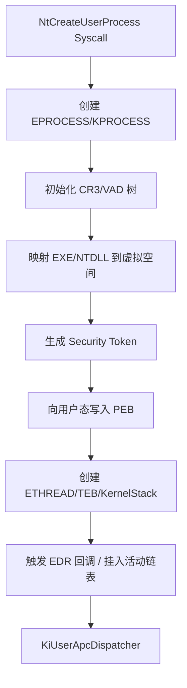

# 程序执行全生命周期：权威修正版 (针对 Windows x64)

这份文档是经过严格核验与修正后的版本。移除了所有不准确的偏移量、虚构的统计数据以及过时的架构描述（如 x86 SEH 混淆进 x64 的情况）。

内容基于 **Windows Internals 7th Edition** 原理及 **Windows 11 (x64) 实机逆向** 逻辑。

## PEB

在 Windows 中，每个进程都有一个 PEB (Process Environment Block)

### PEB结构

## ⚠️ 关键技术声明 (必读)

1. **结构体不透明性**：`EPROCESS`, `ETHREAD`, `KPROCESS` 等内核结构体是 **非公开 (Opaque)** 的。微软从未保证其成员偏移量（Offsets）的稳定性。文中标记的偏移量仅为示例或特定历史版本，实战中**必须**通过符号文件 (`.pdb`) 或运行时特征码搜索动态获取。
2. **ASLR (地址空间布局随机化)**：现代 Windows (Vista+) 强制开启 ASLR。文中出现的内存地址仅为**逻辑示意**，实际运行时基址、堆栈地址每次启动均不同。
3. **架构限定**：本文核心描述 **x64 (AMD64)** 架构下的 Windows 运行机制。

---

## 📊 一、程序执行的 5 大核心阶段概览

| 阶段 | 执行环境 | 关键操作 (逻辑流) | 涉及核心数据结构 |
| :--- | :--- | :--- | :--- |
| **1. 启动请求** | 用户模式 (Ring 3) | 验证路径 / 参数打包 / 系统调用 | `STARTUPINFO`, `RTL_USER_PROCESS_PARAMETERS` |
| **2. 内核构造** | 内核模式 (Ring 0) | 创建进程对象 / 映射内存 / 创建初始线程 | `EPROCESS`, `ETHREAD`, `VAD` Tree |
| **3. 用户注入** | 内核写入用户态 | 填充用户空间环境 / 映射 NTDLL | **`PEB`**, `TEB`, `KUSER_SHARED_DATA` |
| **4. 加载器初始化**| 用户模式 (Ring 3) | LDR 链表构建 / DLL 加载 / 导入表修复 | `PEB_LDR_DATA`, `LDR_DATA_TABLE_ENTRY` |
| **5. 运行时** | 用户模式 (Ring 3) | CRT 初始化 / Main / 异常分发 | `.pdata` (`RUNTIME_FUNCTION`), Heap |

---

## 🧩 二、阶段 1：启动请求 (Ring 3 -> Ring 0 过渡)

### 2.1 触发流程

用户调用 `CreateProcess` 后，请求由 `kernel32.dll` -> `kernelbase.dll` 传递，最终在 `ntdll.dll` 处转为系统调用。

### 2.2 核心动作：参数打包

父进程在**自己的堆**上为子进程准备参数块。注意：这部分内存尚在父进程中。

```c
// Windows SDK - winternl.h
// 由父进程构造，随后内核会将其拷贝到子进程地址空间
typedef struct _RTL_USER_PROCESS_PARAMETERS {
    ULONG MaximumLength;
    ULONG Length;
    ULONG Flags;
    // ...
    HANDLE ConsoleHandle;
    ULONG ConsoleFlags;
    HANDLE StdInputHandle;
    HANDLE StdOutputHandle;
    HANDLE StdErrorHandle;
    UNICODE_STRING CurrentDirectory;
    UNICODE_STRING DllPath;
    UNICODE_STRING ImagePathName;
    UNICODE_STRING CommandLine;   // ★ 红队重点：进程欺骗常修改此处
    PVOID Environment;            // ★ 环境变量块
    // ...
} RTL_USER_PROCESS_PARAMETERS, *PRTL_USER_PROCESS_PARAMETERS;
```

**关键修正**：权限检查 (`Access Check`) 不是完全在阶段 1 完成的。用户态只做基本的 Token 检查，真正的安全令牌生成和内核对象访问检查发生在 **阶段 2 (SeCreateAccessStateEx)**。

---

## ⚙️ 三、阶段 2 & 3：内核构造与注入 (Ring 0)

这是操作系统执行体 (Executive) 分配资源的核心阶段。

### 3.1 核心流程 (Windows Kernel Logic)



### 3.2 关键内核对象 (不可硬编码偏移)

#### 3.2.1 EPROCESS (执行体进程块)

这是内核管理进程的核心。**注意：偏移量随 Windows 版本剧烈变动。**

```c
// 伪代码结构示意 (请勿硬编码偏移!)
struct _EPROCESS {
    struct _KPROCESS Pcb;          // 调度信息 (CR3 页目录基址在此)
    // ...
    PVOID UniqueProcessId;         // PID (Win11 中位置约为 0x440 附近)
    struct _LIST_ENTRY ActiveProcessLinks; // 双向链表，连接所有进程 (Win11 约为 0x448)
    struct _EX_FAST_REF Token;     // 安全令牌 (提权攻击的目标)
    PVOID Peb;                     // ★ 指向用户态 PEB 的指针 (Win11 约为 0x550)
    // ...
    // EDR 通常在此处注册的 ProcessNotifyRoutine 回调中拦截进程
};
```

### 3.3 内核构建的用户态结构

内核虽然在 Ring 0，但它直接向新进程的 Ring 3 内存空间写入以下关键结构：

#### 3.3.1 PEB (Process Environment Block)

`GS:[0x60]` 指向 PEB。它是用户态全局信息的根节点。

```c
typedef struct _PEB {
    BOOLEAN InheritedAddressSpace;
    BOOLEAN ReadImageFileExecOptions;
    BOOLEAN BeingDebugged;         // 反调试检查点 IsDebuggerPresent()
    // ...
    PVOID ImageBaseAddress;        // EXE 加载基址 (受 ASLR 影响)
    PPEB_LDR_DATA Ldr;             // ★ 指向加载器数据 (此时 Ldr 内容尚未初始化!)
    PRTL_USER_PROCESS_PARAMETERS ProcessParameters; // 指向从父进程拷贝过来的参数块
    // ...
    // Windows 10+ 包含 LdrpHeap 随机化种子等安全字段
} PEB, *PPEB;
```

**修正**：在阶段 2/3 结束时，**`PEB.Ldr` 虽然有指针，但指向的数据结构主要字段为空**。DLL 列表是在用户态初始化阶段 (阶段 4) 才构建的。

#### 3.3.2 TEB (Thread Environment Block)

`GS:[0x0]` 指向 TEB。

```c
typedef struct _TEB {
    NT_TIB NtTib;                  // 线程信息块 (栈底、栈顶范围)
    PVOID EnvironmentPointer;
    CLIENT_ID ClientId;            // PID, TID
    PVOID ThreadLocalStoragePointer; // TLS 数组指针
    PPEB ProcessEnvironmentBlock;  // 指回 PEB
    ULONG LastErrorValue;
    // ...
} TEB, *PTEB;
```

---

## 📦 四、阶段 4：用户态加载器 (ntdll!LdrInitializeThunk)

此时线程从内核返回，RIP 指向 `ntdll`。这是 **API Hashing 和 Manual Mapping** 主要模仿或绕过的阶段。

### 4.1 核心动作

1. **LdrpInitializeProcess**: 初始化进程堆 (`RtlCreateHeap`)。
2. **构建链表**: 分配并初始化 `PEB_LDR_DATA`，建立三个模块链表 (`InLoadOrder`, `InMemoryOrder`, `InInitOrder`)。此时链表中只有 `ntdll` 和 `exe`。
3. **递归加载依赖**: 扫描 IAT (导入表)，调用 `LdrLoadDll` 加载 Kernel32 等依赖。
4. **TLS 回调**: 执行 `.tls` 段中的回调函数（恶意软件常在此驻留，早于 OEP）。

### 4.2 核心链表结构

```c
// PEB->Ldr 指向此处
typedef struct _PEB_LDR_DATA {
    ULONG Length;
    BOOLEAN Initialized;
    PVOID SsHandle;
    LIST_ENTRY InLoadOrderModuleList;
    LIST_ENTRY InMemoryOrderModuleList;      // ★ 红队最爱：按内存布局排序，容易解析 DllBase
    LIST_ENTRY InInitializationOrderModuleList;
} PEB_LDR_DATA, *PPEB_LDR_DATA;

// 链表节点
typedef struct _LDR_DATA_TABLE_ENTRY {
    LIST_ENTRY InLoadOrderLinks;
    LIST_ENTRY InMemoryOrderLinks;
    LIST_ENTRY InInitializationOrderLinks;
    PVOID DllBase;                           // ★ DLL 基址
    PVOID EntryPoint;
    ULONG SizeOfImage;
    UNICODE_STRING FullDllName;
    UNICODE_STRING BaseDllName;              // ★ 用于 API Hashing 对比的名字
    // ...
} LDR_DATA_TABLE_ENTRY, *PLDR_DATA_TABLE_ENTRY;
```

---

## 🚀 五、阶段 5：运行时与异常处理 (x64修正)

### 5.1 x64 异常处理模型 (Table-Based)

**修正说明**：旧文档常提到的“栈上构建 SEH 链表 (`fs:[0]`)”是 **x86 (32位)** 的机制。**x64 完全不同**，不再依赖栈上的链表，而是依赖静态数据表。

1. **`.pdata` 段**: 编译器生成的 `.pdata` 节包含 `RUNTIME_FUNCTION` 结构体数组。
2. **`RUNTIME_FUNCTION`**:

    ```c
    typedef struct _RUNTIME_FUNCTION {
        DWORD BeginAddress; // 函数起始 RVA
        DWORD EndAddress;   // 函数结束 RVA
        DWORD UnwindData;   // 指向 Unwind Info (展开信息) 的指针
    } RUNTIME_FUNCTION;
    ```

3. **栈回溯 (Unwinding)**: 当异常发生或 EDR 检查堆栈时，系统调用 `RtlVirtualUnwind`，通过查找当前 RIP 对应的 `.pdata` 记录，计算出上一帧的 RSP 和 RIP。**这就是 `uwd` (Stack Spoofing) 技术欺骗的核心对象。**

### 5.2 堆管理

Windows 10+ 引入了 **Segment Heap** (用于 UWP/Edge) 和传统的 **NT Heap** (LFH - Low Fragmentation Heap)。堆结构的头部包含 cookie (XOR key) 用于防止溢出攻击。

---

## 💎 六、权威数据源指引

如果需要获取当前系统最准确的结构体偏移，请勿依赖静态文章，应使用 **WinDbg** 现场调试获取：

* **获取 EPROCESS 偏移**:
    `dt nt!_EPROCESS -r` (在内核调试模式下)
* **获取 PEB 结构**:
    `dt nt!_PEB`
* **查看 LDR 链表**:
    `!peb` (会自动解析并打印 LDR 链表内容)

---

### 总结：关键差异点

| 概念 | x86 (Legacy) | **x64 (Modern)** |
| :--- | :--- | :--- |
| **TEB 指针** | `FS:[0]` | **`GS:[0]`** |
| **PEB 指针** | `FS:[0x30]` | **`GS:[0x60]`** |
| **系统调用指令** | `int 0x2e` / `sysenter` | **`syscall`** |
| **调用约定** | `stdcall` / `cdecl` (栈传参) | **FastCall** (RCX, RDX, R8, R9 寄存器传参 + Shadow Space) |
| **异常处理** | 栈链表 (`_EXCEPTION_REGISTRATION`) | **基于表 (`RUNTIME_FUNCTION` / .pdata)** |
| **内核防护** | 较少 | **PatchGuard (KPP)**, **DSE (签名强制)**, **HVCI** |

这才是你在 2025 年进行 Rust 顶级红队开发（Syscall / Stack Spoofing / Rootkit）所依赖的真实底层图景。

## PE

这是一个关于 **PE (Portable Executable) 文件格式** 的全景式深度解构。

为了让你能够独立编写解析器（例如为了理解 `dinvk` 如何手动加载 DLL，或者 `uwd` 如何解析异常表），我们不能只看概览，必须看**内存布局**(使用windbg)和**C 语言结构体定义**(msdn)。

PE 文件本质上是**“线性存储的数据结构集合”**。在磁盘上和在内存中，它们的逻辑顺序一致，但物理间距（对齐）不同。

---

### 🗺️ PE 文件全景地图 (Memory Layout)

首先，在脑海中建立这个物理模型。假设内存地址从低到高向下增长：

```text
基地址 (ImageBase) ----> +-----------------------------+
                        |      MS-DOS Header          |  <- "MZ" 头
                        +-----------------------------+
                        |       MS-DOS Stub           |  <- 历史遗留废话
                        +-----------------------------+
ntHeaders 指针 -------->|      PE Signature           |  <- "PE\0\0"
(DOS.e_lfanew)          +-----------------------------+
                        |    IMAGE_FILE_HEADER        |  <- 物理概况 (CPU架构, 节数量)
                        +-----------------------------+
                        | IMAGE_OPTIONAL_HEADER (64)  |  <- 逻辑核心 (OEP, ImageBase)
                        |                             |
                        |   [ Data Directories ]      |  <- *关键数组* (导出表/导入表索引)
                        +-----------------------------+
SectionHeaders 指针 --->|   IMAGE_SECTION_HEADER [0]  |  <- .text 的描述信息
                        |   IMAGE_SECTION_HEADER [1]  |  <- .rdata 的描述信息
                        |   ...                       |
                        +-----------------------------+
                        |         (填充/Padding)      |  <- 对齐间隙
                        +=============================+
                        |        Section .text        |  <- 真正的代码
                        +-----------------------------+
                        |        Section .rdata       |  <- 常量/导入表数据
                        +-----------------------------+
                        |        Section .data        |  <- 全局变量
                        +-----------------------------+
                        |        Section .reloc       |  <- 重定位数据
                        +-----------------------------+
```

---

### 🧬 核心数据结构详解

以下结构体均定义在 Windows SDK 的 `winnt.h` 中。

#### 1. IMAGE_DOS_HEADER (DOS 头)

* **位置**：文件偏移 `0x00`。
* **作用**：为了兼容 1980 年代的 DOS 系统，现在主要是为了找到 NT 头。
* **关键成员**：
  * `e_magic`: **WORD (2字节)**。必须是 `0x5A4D` (**"MZ"**)。
  * `e_lfanew`: **LONG (4字节)**。位于偏移 `0x3C` 处。**这是指向 PE 头（NT Headers）的文件偏移量**。这是解析的第一跳。

#### 2. IMAGE_NT_HEADERS64 (NT 头)

* **位置**：`基地址 + e_lfanew`。
* **结构**：

    ```c
    struct IMAGE_NT_HEADERS64 {
        DWORD Signature;                // 0x00004550 ("PE\0\0")
        IMAGE_FILE_HEADER FileHeader;
        IMAGE_OPTIONAL_HEADER64 OptionalHeader;
    };
    ```

**2.1 IMAGE_FILE_HEADER (文件头)**

* **位置**：紧跟 Signature 之后。
* **作用**：描述文件的物理属性。
* **关键成员**：
  * `Machine`: `0x8664` (AMD64) 或 `0x14C` (i386)。
  * `NumberOfSections`: **WORD**。决定了后面要读取多少个节表项。**循环解析节表时的计数器**。
  * `SizeOfOptionalHeader`: 后面那个结构体的大小。

**2.2 IMAGE_OPTIONAL_HEADER64 (可选头)**

* **位置**：紧跟 File Header 之后。
* **作用**：PE 的灵魂，告诉 OS 加载器如何运行它。
* **关键成员**：
  * `AddressOfEntryPoint` (OEP): **RVA**。程序启动后 IP 指针指向的第一行代码（通常是 `mainCRTStartup`）。
  * `ImageBase`: **QWORD**。程序的首选加载内存地址。
  * `SectionAlignment`: 内存对齐粒度（通常 4KB / `0x1000`）。
  * `FileAlignment`: 磁盘对齐粒度（通常 512B / `0x200`）。
  * **`DataDirectory[16]`**: **这是红队最关注的数组**。它包含 16 个关键数据结构的 **地址 (RVA)** 和 **大小**。

**DataDirectory 的关键索引**：

* **[0] Export Table** (`dinvk` 解析的目标)
* **[1] Import Table** (正常 IAT)
* **[3] Exception Table** (`uwd` 需要解析的 `.pdata`)
* **[5] Base Relocation Table** (手动映射必须处理的)

#### 3. IMAGE_SECTION_HEADER (节表)

* **位置**：紧跟在 NT Headers 后面。
* **作用**：目录表。描述了真实数据（代码、变量）在哪里，以及有多大。
* **数量**：由 `FileHeader.NumberOfSections` 决定。
* **结构成员 (关键)**：
  * `Name`: 8 字节 ASCII (e.g., ".text")。注意不一定以 `\0` 结尾。
  * `VirtualSize`: 数据在内存中未对齐前的真实大小。
  * **`VirtualAddress` (RVA)**: 该节被映射到内存后的起始偏移。**ImageBase + VirtualAddress = 内存真实地址**。
  * `SizeOfRawData`: 该节在磁盘文件中对齐后的大小。
  * **`PointerToRawData`**: 该节在磁盘文件中的起始偏移。
  * **`Characteristics`**: 权限位掩码。
    * `0x20000000` (Executable)
    * `0x40000000` (Readable)
    * `0x80000000` (Writable) - **警报：**如果 .text 段有此标志，必杀。

#### 4. The Sections (具体的节内容)

这些不是结构体，而是大块的二进制数据，由上面的节表指向。

* **`.text` 段**:
  * 存放机器码 (OpCode)。
  * `Indirect Syscall` 的跳板 (`syscall; ret`) 就藏在这里面。
* **`.rdata` 段** (Read-only Data):
  * **导出表 (Export Directory)** 通常在这里。
    * `IMAGE_EXPORT_DIRECTORY` 结构体：包含 `AddressOfFunctions`, `AddressOfNames`, `AddressOfNameOrdinals` 三个并列数组。**这是 dinvk 实现 GetProcAddress 的核心数据源**。
  * **导入表 (Import Directory)** 及其 Lookup Table。
  * **异常目录 (Exception Directory)**：`RUNTIME_FUNCTION` 数组，用于栈回溯。**这是 uwd 的核心数据源**。
* **`.reloc` 段**:
  * 包含一堆数据块，告诉加载器：“如果我的加载基址变了（ASLR），请帮我把代码里 offset `0x100` 和 offset `0x500` 处的硬编码地址修改一下。”

---

### 🧱 实战案例：从 dinvk 视角看结构链

当你调用 `dinvk::get_function_address` 时，代码实际上是在做如下跳跃：

1. **输入**：模块内存基址 `BaseAddress`。
2. **跳跃**：
    * `DOS` -> `NT` (`Base + DOS.e_lfanew`)
    * `NT` -> `Optional` -> `DataDirectory[0]` (导出表 RVA)。
3. **定位**：`ExportDir = BaseAddress + DataDirectory[0].VirtualAddress`。
4. **遍历**：读取 `ExportDir->AddressOfNames` (指向一堆字符串指针)。
5. **计算**：`PointerToFunctionName = BaseAddress + NameRVA`。
6. **对比**：拿到字符串，算 Hash，和目标 Hash 对比。
7. **结果**：如果匹配，去 `AddressOfFunctions` 数组取对应下标的函数地址 RVA。
8. **输出**：`BaseAddress + FunctionRVA`。

---

### 🧪 学习小技巧：偏移计算 (Address Conversion)

在红队开发中（特别是做 Manual Mapping 时），你必须精通 **RVA 转 FOA** 的计算：

* **RVA (Relative Virtual Address)**: 内存中的偏移。
* **FOA (File Offset Address)**: 磁盘文件中的偏移。

**转换逻辑**：

1. 遍历所有 **节表 (Section Headers)**。
2. 判断：目标 RVA 是否在 `[Section.VirtualAddress, Section.VirtualAddress + Section.VirtualSize]` 区间内？
3. 如果中：
    * `偏移量 = RVA - Section.VirtualAddress`
    * `FOA = Section.PointerToRawData + 偏移量`

掌握了这个，你就打通了“文件”与“内存”的壁垒，这是写加载器的终极内功。

## 为什么如果一个导出函数的 RVA 指向了导出目录 (Export Directory) 所在的内存范围内那么它一定不是代码，而是一个转发字符串 (Forwarder String)

逻辑：导出目录开始 <= 地址 < 导出目录结束

这是 Windows PE (Portable Executable)文件格式设计中的一个“空间优化技巧”，或者说是一个“硬性约定”。  
微软为了节省空间，没有为“是否是转发函数”单独设计一个标志位（Flag），而是复用了函数地址字段，通过判断地址范围来区分它是“真正的代码”还是“转发字符串”。

1. 正常的代码绝不可能在这个范围内导出目录 (Export Directory) 本身是一个纯数据结构（包含IMAGE_EXPORT_DIRECTORY 结构体、函数名数组、序号数组、地址数组等）  
这块区域存的全是表格数据  
真正的函数代码（汇编指令）通常位于 .text代码段，距离导出目录（通常在 .edata 或 .rdata 段）非常远。  
逻辑互斥：有效的机器码不可能“寄生”在导出表的数据结构内部。如果代码真的写在这里，它会覆盖掉导出表的数据，导致 DLL 格式损坏
2. 设计者的思路：复用 AddressOfFunctions  
当 Windows 加载器 (Loader) 解析导出表时，它会读取 AddressOfFunctions数组里的 RVA (Relative Virtual Address)。此时面临两种情况：

* 情况 A：普通导出函数我们需要指向函数的代码入口。RVA 指向代码段。
* 情况 B：转发函数 (Forwarder)我们需要一个字符串（例如"NTDLL.RtlAllocateHeap"）来告诉加载器去哪里找这个函数。

设计者不想增加额外的字段（比如加个 boolisForwarder），那样会浪费空间并破坏对齐。于是他们制定了这条规则：
> “如果在取出的 RVA 地址处，发现居然刚好落在了导出目录在这个 DLL里的地盘内，那它一定不是代码（因为代码不可能写在目录表里），而是指向了一个字符串。”