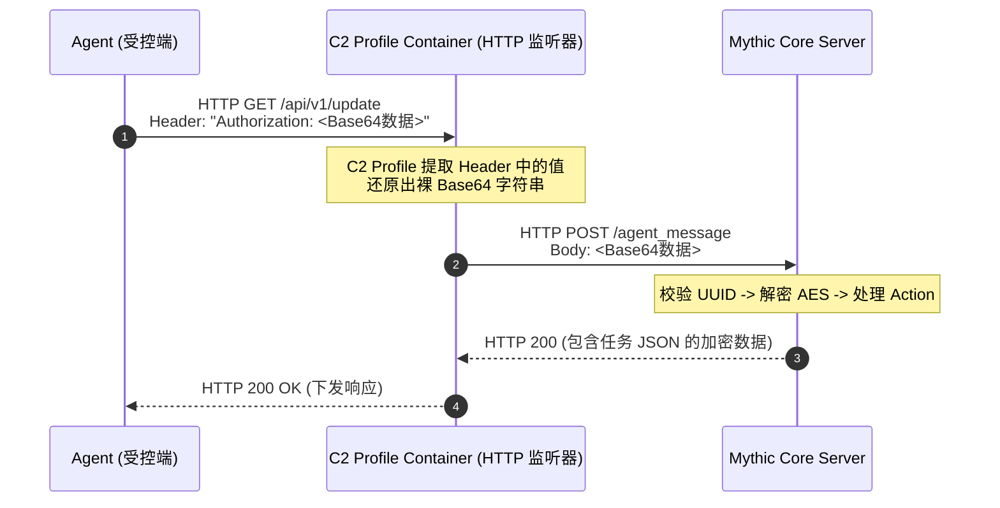
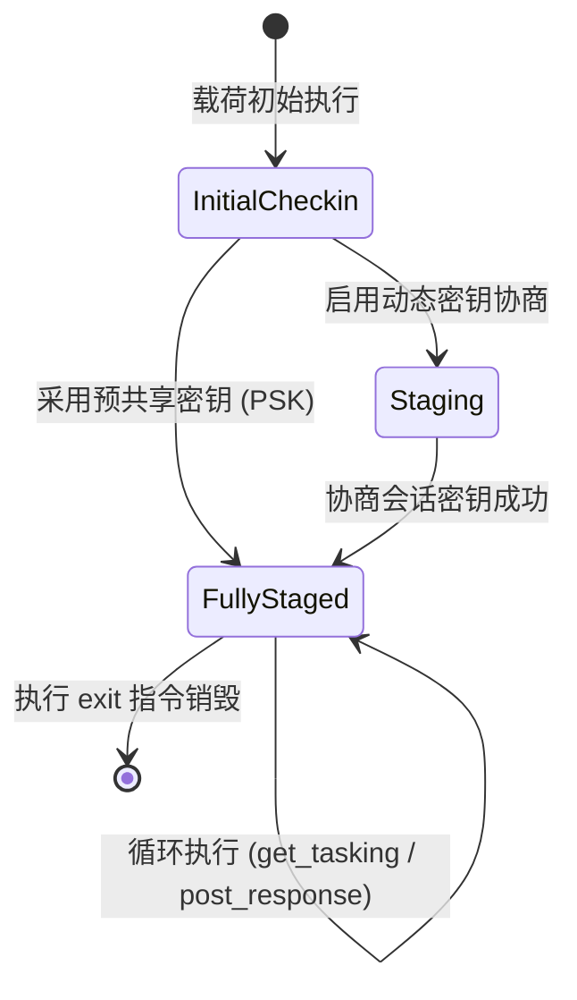

- [Mythic 4.0 Agent 报文规范指南（Agent Message Format）](#mythic-40-agent-报文规范指南agent-message-format)
  - [一、Agent 报文传输层类型（Transport Types）](#一agent-报文传输层类型transport-types)
    - [1.1 核心线协议公式（Wire Protocol Formula）](#11-核心线协议公式wire-protocol-formula)
    - [1.2 POST 请求模式：Message Content in Body](#12-post-请求模式message-content-in-body)
      - [1. 语义特征](#1-语义特征)
      - [2. 线上典型 HTTP 报文流](#2-线上典型-http-报文流)
    - [1.3 GET 请求模式：Message Content in Header / Cookie / Query / Body](#13-get-请求模式message-content-in-header--cookie--query--body)
      - [1. 工程背景与代理中间件约束](#1-工程背景与代理中间件约束)
      - [2. 报文承载方式与提取位置](#2-报文承载方式与提取位置)
      - [3. `FIRST header value` 的实现机理与控制面对齐](#3-first-header-value-的实现机理与控制面对齐)
      - [4. C2 Profile 容器的中间转发管道时序](#4-c2-profile-容器的中间转发管道时序)
  - [二、Agent 报文信封结构（Envelope Structure）](#二agent-报文信封结构envelope-structure)
    - [2.1 整体封装伪代码](#21-整体封装伪代码)
    - [2.2 核心构成要素深度解析](#22-核心构成要素深度解析)
      - [1. 前置标识符：UUID](#1-前置标识符uuid)
      - [2. UUID 物理表示模式对比](#2-uuid-物理表示模式对比)
      - [3. 加密数据块：EncBlob](#3-加密数据块encblob)
      - [4. 明文业务字典：JSON](#4-明文业务字典json)
      - [5. 核心动作路由：Action](#5-核心动作路由action)
      - [6. 多跳网格中继：Delegates](#6-多跳网格中继delegates)
      - [7. 拼接操作符：`+`](#7-拼接操作符)
  - [三、典型业务场景报文示例（逻辑解密态示意）](#三典型业务场景报文示例逻辑解密态示意)
    - [3.1 初始签入（Initial Checkin）](#31-初始签入initial-checkin)
    - [3.2 任务拉取轮询（Get Tasking）](#32-任务拉取轮询get-tasking)
    - [3.3 带 P2P 网格中继的任务轮询（Get Tasking with P2P Delegates）](#33-带-p2p-网格中继的任务轮询get-tasking-with-p2p-delegates)
    - [3.4 任务执行结果提交（Post Response，包含文件下载 Hooking）](#34-任务执行结果提交post-response包含文件下载-hooking)


# Mythic 4.0 Agent 报文规范指南（Agent Message Format）

---

## 一、Agent 报文传输层类型（Transport Types）

所有由 Agent 产生的出站报文最终均会通过关联的 C2 Profile 容器路由至 Mythic 核心服务的 `/agent_message` 端点。

### 1.1 核心线协议公式（Wire Protocol Formula）
$$\text{message content} = \text{Base64}\Big(\text{UUID} \parallel \text{EncBlob}\big(\text{JSON}(\mathbf{M})\big)\Big)$$

> [!IMPORTANT]
> **编码与字符集约束**：
> - **全局编码**：最外层的 `message content` 是经过 Base64 编码的纯 ASCII 字符串。
> - **JSON 文本字符集**：内部的 JSON 文本必须严格采用 **Unicode（UTF-8）** 编码。
> - **字段级 Base64**：JSON 字典内部的基础类型（`String`、`Integer`、`Boolean` 等）按原样序列化；对于可能包含非法控制字符（`0x00~0x1F`）或不可控二进制流的业务字段（如文件分块、SOCKS 代理数据帧、P2P 嵌套报文），**必须在填入 JSON 前单独进行一次 Base64 编码**。

---

### 1.2 POST 请求模式：Message Content in Body

适用于常规数据上报、大体积任务执行回显与文件流式传输。

#### 1. 语义特征
- 原生支持在请求头之后携带任意长度的二进制或文本数据载荷。
- 数据直接以完整 Base64 字符串的形式写入 HTTP 请求体（Request Body）。

#### 2. 线上典型 HTTP 报文流
```http
POST /api/v1/submit HTTP/1.1
Host: c2.internal-service.com
User-Agent: Mozilla/5.0 (Windows NT 10.0; Win64; x64)
Content-Type: text/plain; charset=utf-8
Content-Length: 148
Connection: close

YWJjZDEyMzQtMDAwMC0wMDAwLTAwMDAtMDAwMDAwMDAwMDAwMDEyMzQ1Njc4OWFiY2RlZi...[完整的 Base64 字符串]...==
```

> [!NOTE]
> 在 HTTP 标头（Headers）与主体（Body）之间存在标准协议定界符双换行（CRLF，`\r\n\r\n`），其后紧随的就是完整的 `message content`（尾部的 `=` 或 `==` 为标准 Base64 填充符）。

---

### 1.3 GET 请求模式：Message Content in Header / Cookie / Query / Body

用于规避网络监控（NDR/WAF）对异常 HTTP 动词分布特征的识别，模拟常规端点拉取 Web 资源的轻量通信。

#### 1. 工程背景与代理中间件约束
- **行为特征混淆**：正常端点通信中 `GET` 请求占比最高。若心跳轮询全使用 `POST` 会产生显著的统计学特征异常。
- **代理截断防御**：依据 HTTP 规范，企业级前向代理（Forward Proxy）或反向代理（Reverse Proxy）会对请求执行合规清洗。若 `GET` 请求携带实体主体（Body），代理中间件通常会直接丢弃、截断主体或阻断连接。

#### 2. 报文承载方式与提取位置

| 模式名称 | 报文承载位置 | 协议特征与实现细节 |
| :--- | :--- | :--- |
| **`FIRST header value`** | 指定 HTTP 标头值 | 将核心长字符串置于预设自定义标头中（如 `Authorization: <message_content>`）。具有极高的抗审查能力，不受 URL 长度限制。 |
| **`FIRST cookie value`** | HTTP Cookie 标头 | 数据作为 Cookie 键值对传入（如 `Cookie: session=<message_content>`）。常用于模拟合法的 Web 状态凭据。 |
| **`FIRST query parameter`** | URL Query 参数 | 附加在 URL 路径之后（如 `GET /api/v1/check?q=<message_content>`）。<br/>**强制要求**：此时必须使用 **URL-Safe Base64（RFC 4648 §5）** 编码（将 `+` 替换为 `-`，`/` 替换为 `_`），避免 URI 组件转义污染。 |
| **`body`** | GET 请求体（Body） | 直接将数据写入 `GET` 请求主体。仅能在无严格代理审查的直连内网实验环境生效。 |

#### 3. `FIRST header value` 的实现机理与控制面对齐
Mythic 的 `http` C2 Profile 中提供字典参数 `headers`。操作员生成 Agent 时可配置用于流量伪装的标头列表：
- 标头 1：`Authorization`
- 标头 2：`User-Agent`
- 标头 3：`X-Forwarded-For`

标头键名可使用任意合规 ASCII 标识符（如 `X-Session-Token`、`Sec-Fetch-Token`、`Custom-Telemetry-Data`）。在现代 Web 架构中，使用 `Authorization: Bearer <token>` 承载长 Base64 字符串能最大程度利用安全网关对 JWT 凭证的白名单容忍度。

**报文结构呈现**：
```http
GET /api/v1/update HTTP/1.1
Host: update.internal-service.com
User-Agent: Mozilla/5.0 (Windows NT 10.0; Win64; x64)
Authorization: eyJ1dWlkIjoi...[Base64 编码的 message content]...
Accept: */*
```

#### 4. C2 Profile 容器的中间转发管道时序
无论客户端选用哪种 `GET` 承载方式，C2 容器均会解封装并归一化为标准的 POST 请求打入 Mythic 核心服务：



---

## 二、Agent 报文信封结构（Envelope Structure）

所有 Agent 报文遵循同一套通用的外层封装信封，差异仅存在于解密后的 JSON 内部载荷。

### 2.1 整体封装伪代码
```text
base64(
    UUID + EncBlob( // 密文段：使用会话密钥加密
        JSON({
            "action": "", // 必须字段：标识该报文的操作语义
            "...": ...    // 必须字段：与 action 相关的业务数据

            // 可选字段：用于多跳 P2P 网格中继转发
            "delegates": [
                {"message": "BASE64_AGENT_MSG", "c2_profile": "ProfileName", "uuid": "uuid here"},
                {"message": "BASE64_AGENT_MSG", "c2_profile": "ProfileName", "uuid": "uuid here"}
            ]
        })
    )
)
```

---

### 2.2 核心构成要素深度解析

#### 1. 前置标识符：UUID
- **定位**：在明文阶段唯一暴露的元数据，服务端在尚未解密前，通过该 UUID 作为主键检索对应的加密算法上下文、密钥与目标状态。
- **状态机迁移驱动（State Machine Driven）**：UUID 随着 Agent 生命周期阶段发生跃迁。



| 状态机阶段（Phase） | 使用的 UUID 类型 | 生成源与存活周期 | 对应操作语义（Action） |
| :--- | :--- | :--- | :--- |
| **Initial Checkin（初始签入）** | `PayloadUUID` | 服务端生成载荷时分配，硬编码于二进制中，用于标识载荷模板。 | 首次向服务端发起 `action: "checkin"` 握手，服务端据此实例化会话。 |
| **Staging（密钥协商/分阶段）** | `StagingUUID` | 仅在启用非对称密钥交换时由服务端动态签发；属于临时态。 | 执行 `action: "staging_rsa"` 等握手交互，绑定中间态密钥对。 |
| **Fully Staged（就绪/运行态）** | `CallbackUUID` | 服务端在成功处理 `checkin` 报文后动态分配，通过响应体回传。 | 后续所有常规心跳（`action: "get_tasking"`）与结果提交（`action: "post_response"`）。 |

> [!TIP]
> **Agent 状态维护**：Agent 内部会话上下文应当使用状态机维护。一旦接收到 Checkin 成功回执并提取出 `CallbackUUID`，后续出站报文头部的前置 UUID 必须彻底覆盖为 `CallbackUUID`。

#### 2. UUID 物理表示模式对比

| 物理编码模式 | 内存表示（Rust 1.91 映射） | 报文特征 | 优势与劣势 |
| :--- | :--- | :--- | :--- |
| **36 字节模式**<br/>*(官方默认)* | `[u8; 36]`<br/>如 `b"b50a5fe8-099d-4611-a2ac-96d93e6ec77b"`<br/>*(标准 `8-4-4-4-12` 结构)* | 连字符定界清晰，RFC 4122 标准 ASCII 格式。 | **优**：生态兼容性极强，Wireshark 与文本日志可读性高。<br/>**劣**：空间开销大（Base64 膨胀为 48 字节），存在固定文本指纹。 |
| **16 字节大端序模式**<br/>*(空间优化)* | `[u8; 16]` / `u128`<br/>如 `[0xb5, 0x0a, ..., 0x7b]` | 紧凑型大端序（Big-Endian）裸二进制字节数组。 | **优**：空间利用率高（降低 55%），无静态字符串特征。<br/>**说明**：Mythic 服务端**原生支持双模识别**，仅在使用纯二进制非 JSON 私有通信时才需外挂 Translation Container。 |

#### 3. 加密数据块：EncBlob
- 通常采用 AES-256（CBC 或 GCM 模式）进行对称加密。
- 在 Staging 握手阶段，可承载由 RSA 公钥加密的随机密钥块。

#### 4. 明文业务字典：JSON
- 解密后的真实有效载荷。若使用自定义二进制通信协议，则由 Translation Container 负责在进入 Mythic 核心前将其转码为此标准格式。

#### 5. 核心动作路由：Action
- `"checkin"`：初始握手上报端点信息。
- `"get_tasking"`：轮询服务端提取任务指令队列。
- `"post_response"`：回传指令执行输出、状态码与功能挂钩数据。
- `"staging_rsa"`：发起 RSA 非对称密钥协商。
- `"translation_staging"`：由翻译容器托管的私有握手。

#### 6. 多跳网格中继：Delegates
- 嵌套结构，用于将处于隔离子网中的 P2P Agent（如 SMB/TCP Pipe 节点）的完整加密报文，作为 Base64 文本嵌入出口节点的报文中统一转发。

#### 7. 拼接操作符：`+`
- 表示物理层面的无缝二进制内存级联拼接（Concatenation）：$$\text{UUID} \parallel \text{EncBlob}$$

---

## 三、典型业务场景报文示例（逻辑解密态示意）

> [!NOTE]
> 以下示例展示解密后的逻辑报文结构。在线上物理传输时，前置 UUID 与密文块直接拼接，且整体执行外层 Base64 编码。依照 RFC 8259 规范，JSON 内部严禁包含任何尾随逗号。

### 3.1 初始签入（Initial Checkin）
**前置 UUID**：`PayloadUUID`（例如：`a21bab2e-462e-49ab-9800-fbedaf53ad15`）

```json
{
    "action": "checkin",
    "uuid": "a21bab2e-462e-49ab-9800-fbedaf53ad15",
    "user": "bob",
    "domain": "domain.com",
    "pid": 123
}
```

---

### 3.2 任务拉取轮询（Get Tasking）
**前置 UUID**：`CallbackUUID`（例如：`a21bab2e-462e-49ab-9800-fbedaf53ad15`）

```json
{
    "action": "get_tasking",
    "tasking_size": -1
}
```

---

### 3.3 带 P2P 网格中继的任务轮询（Get Tasking with P2P Delegates）
**前置 UUID**：`CallbackUUID`（例如：`a21bab2e-462e-49ab-9800-fbedaf53ad15`）

```json
{
    "action": "get_tasking",
    "tasking_size": -1,
    "delegates": [
        {
            "message": "BASE64_ENCODED_SUB_AGENT_MESSAGE_1",
            "c2_profile": "tcp",
            "uuid": "sub_agent_uuid_1"
        },
        {
            "message": "BASE64_ENCODED_SUB_AGENT_MESSAGE_2",
            "c2_profile": "smb",
            "uuid": "sub_agent_uuid_2"
        }
    ]
}
```

---

### 3.4 任务执行结果提交（Post Response，包含文件下载 Hooking）
**前置 UUID**：`CallbackUUID`（例如：`a21bab2e-462e-49ab-9800-fbedaf53ad15`）

```json
{
    "action": "post_response",
    "responses": [
        {
            "task_id": "c34bab2e-462e-49ab-9800-fbedaf53ad15",
            "completed": true,
            "user_output": "hello world"
        },
        {
            "task_id": "bab3ab2e-462e-49ab-9800-fbedaf53ad15",
            "completed": false,
            "user_output": "downloading file...",
            "download": {
                "total_chunks": 12,
                "chunk_size": 512000,
                "filename": "test.txt",
                "full_path": "C:\\Users\\test\\test.txt",
                "host": "ABC.COM",
                "is_screenshot": false
            }
        }
    ]
}
```


Message Format for Custom Agent Messages
If you want to have a completely custom agent message format (different format for JSON, different field names/formatting, a binary or otherwise formatted protocol, etc), then there’s only two things you have to do for it to work with Mythic.
Base64 encode the message
The first bytes of the message must be the associated UUID (payload, staging, callback).
Mythic uses these first few bytes to do a lookup in its database to find out everything about the message. Specifically for this case, it looks up if the associated payload type has a translation container, and if so, ships the message off to it first before trying to process it.