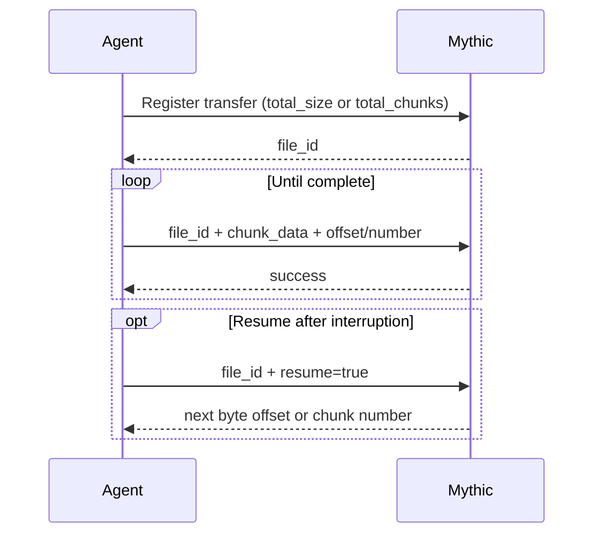

- [File Downloads (Agent -\> Mythic):数据流向完全是从受控端（Agent）传输到服务端（Mythic）.负责将目标受控主机上的文件（或内存转储、截图等二进制数据）分片回传至 C2 服务端进行持久化存储](#file-downloads-agent---mythic数据流向完全是从受控端agent传输到服务端mythic负责将目标受控主机上的文件或内存转储截图等二进制数据分片回传至-c2-服务端进行持久化存储)
  - [Offset mode](#offset-mode)
  - [Resume a transfer](#resume-a-transfer)
    - [二、 核心算法：first contiguous byte offset that has not been received](#二-核心算法first-contiguous-byte-offset-that-has-not-been-received)
      - [1. 为什么强调“连续（Contiguous）”？](#1-为什么强调连续contiguous)
      - [2. 设计目的：极简 Agent 状态机复杂度](#2-设计目的极简-agent-状态机复杂度)
    - [三、 协议数据交互时序](#三-协议数据交互时序)
  - [Numbered chunk compatibility](#numbered-chunk-compatibility)
  - [Common fields](#common-fields)
  - [涉及的异步](#涉及的异步)


# File Downloads (Agent -> Mythic):数据流向完全是从受控端（Agent）传输到服务端（Mythic）.负责将目标受控主机上的文件（或内存转储、截图等二进制数据）分片回传至 C2 服务端进行持久化存储

Send files with byte offsets or legacy遗留 numbered chunks

An agent downloads a file by asking Mythic for a file_id to track the new file, and then posting file data against that ID. Mythic 4.0 supports two mutually exclusive transfer modes:
* Offset mode uses total_size and zero-based chunk_offset.
* Chunk mode uses total_chunks, chunk_size, and one-based chunk_num for compatibility with existing agents.



## Offset mode

Register the file with its byte length. Optional metadata can be supplied during registration or a later data message.
A negative负的 total_size can be updated later when the final size becomes known.

```json
{
  "action": "post_response",
  "responses": [
    {
      "task_id": "agent-task-uuid",
      "download": {
        "total_size": 1048576,
        "full_path": "/var/tmp/archive.bin",
        "host": "WORKSTATION-7",
        "filename": "archive.bin",
        "is_screenshot": false
      }
    }
  ]
}
```

Mythic returns the registered file UUID:

```json
{
  "action": "post_response",
  "responses": [
    {
      "status": "success",
      "file_id": "4b60bd75-bcf4-4c3e-8abe-9566c23b8cb8",
      "task_id": "agent-task-uuid"
    }
  ]
}
```

Send each base64-encoded block with its zero-based position in the file. Blocks can arrive out of order and do not need a fixed size.blocks可以不顺序到达也不需要固定大小.这对原本利用Gemini实现的,多种动态传输大小策略是一种增强策略(任何一个项目都不能只依赖ai,首先需要研究其官方文档)

```json
{
  "action": "post_response",
  "responses": [
    {
      "task_id": "agent-task-uuid",
      "download": {
        "file_id": "4b60bd75-bcf4-4c3e-8abe-9566c23b8cb8",
        "chunk_offset": 0,
        "chunk_data": "AAECAwQFBgc="
      }
    }
  ]
}
```

Mythic marks the file complete after the received byte ranges cover total_size.

## Resume a transfer

To resume an existing file from a later task, send the prior file_id with resume: true. Mythic returns the first contiguous byte offset that has not been received.

```json
{
  "action": "post_response",
  "responses": [
    {
      "task_id": "new-agent-task-uuid",
      "download": {
        "file_id": "4b60bd75-bcf4-4c3e-8abe-9566c23b8cb8",
        "resume": true
      }
    }
  ]
}
```

```json
{
  "action": "post_response",
  "responses": [
    {
      "status": "success",
      "task_id": "new-agent-task-uuid",
      "file_id": "4b60bd75-bcf4-4c3e-8abe-9566c23b8cb8",
      "total_size": 1048576,
      "chunk_offset": 524288,
      "transfer_type": "offset"
    }
  ]
}
```

Mythic 4.0 断点续传协议的核心设计准则：任务生命周期与文件实体的解耦，以及基于低水位线（Low-Water Mark）的连续偏移量协商机制

架构解耦：from a later task 与 prior file_id

在 C2 框架设计中，必须严格区分 操作任务（Task） 与 底层传输实体（File Entity） 的生命周期：

• 任务生命周期的短暂性：
  • 当 Agent 下载一个 5 GB 的大文件时，如果中途网络波动、Beacon 超时、或是操作员误操作将该 Task 终止，原本的 task_id 便进入终态（如 error 或 cancelled）。
  • 按照传统设计，若重新下发任务，通常会导致从头重新下载整个文件。
• 文件传输实体的持久性：
  • Mythic 服务端在数据库中为每次文件传输维护独立的 file_id（UUID），该 ID 在存储层独立存在，生命周期长于单次任务。
  • 协议语义：后续可以在一个**全新的任务（new-agent-task-uuid）**中，不再执行创建新文件的注册流程，而是直接携带先前未完成的 prior file_id 并声明 "resume": true。
  • 服务端行为：服务端收到后，不会重新分配新的存储文件，而是检索与该 file_id 关联的既有文件上下文和已写入的磁盘元数据。

──────
### 二、 核心算法：first contiguous byte offset that has not been received

这句话是断点续传协议的数学与逻辑定义：服务端返回的是从文件首字节（Byte 0）算起，第一个尚未接收的“连续字节偏移量”。

#### 1. 为什么强调“连续（Contiguous）”？

由于 Mythic 4.0 的 Offset Mode 允许数据切片乱序到达（Out-of-Order），在传输中断时，服务端磁盘/缓存中可能出现稀疏区间（Sparse Ranges / Holes）。
假设文件总大小为 1000 字节，在网络断开前，服务端的实际落盘状态如下：

• 已收到区间 A：[0, 499]（共 500 字节，从 0 开始连续）
• 缺失区间 B：[500, 699]（数据包在网络中丢失）
• 已收到区间 C：[700, 899]（属于乱序提前到达的数据块）

此时：
• 服务端已经持久化了 [0, 499] 和 [700, 899] 两段数据。
• 那么从头开始检索，第一个未接收的连续字节索引是多少？答案是 500。
• 服务端不会向 Agent 返回复杂的稀疏碎片列表，而是返回这个连续的边界值："chunk_offset": 500。

#### 2. 设计目的：极简 Agent 状态机复杂度

• 避免在受控端维护区间重组树：如果服务端返回复杂的区间列表（如告诉 Agent 缺 500-699，又缺 900-1000），Agent 内部就必须实现类似 TCP SACK（选择性确认）的复杂重传队列和缓冲区切片算法，导致 Agent 二进制体积显著膨胀、逻辑脆弱。
• 单次定位，单向流式推送：
Agent 收到该回执后，处理逻辑被简化为单一的标准 I/O 操作：

```rust
// 直接跳转至服务端未连续确认的首字节位置
file.seek(SeekFrom::Start(chunk_offset)).await?;
```

随后从该偏移量开始，恢复统一的流式切片读取循环。即使某些后续乱序块（如上述的 [700, 899]）被再次读取并覆盖写入，服务端直接执行基于绝对偏移的幂等覆盖，以极小的冗余代价换取了状态机的极致健壮性。

──────
### 三、 协议数据交互时序

```text
  [新任务派发]
  Agent                           Mythic Server
    │                                   │
    │─── 1. 发起断点恢复协商 ──────────►│
    │    task_id: "new-task-uuid"       │
    │    download: {                    │
    │      file_id: "prior-uuid",       │
    │      resume: true                 │
    │    }                              │
    │                                   │ 检索 file_id 存储状态
    │                                   │ 计算从 0 开始的连续已写入长度
    │                                   │ (e.g. 524,288 字节)
    │                                   │
    │◄── 2. 返回首个缺失的连续偏移量 ──│
    │    status: "success"              │
    │    chunk_offset: 524288           │
    │                                   │
    │ [Agent 调度 file.seek(524288)]    │
    │                                   │
    │─── 3. 从该偏移量继续推送切片 ────►│
    │    download: {                    │
    │      file_id: "prior-uuid",       │
    │      chunk_offset: 524288,        │
    │      chunk_data: "..."            │
    │    }                              │
```

Continue sending data from the returned chunk_offset. For a numbered transfer, the same resume request returns total_chunks, chunk_size, and the next one-based chunk_num instead.

## Numbered chunk compatibility

Mythic 4.0 为了向后兼容（Backward Compatibility）旧版本（Mythic 2.x / 3.x）Agent 载荷而保留的 传统分块编号协议（Legacy Numbered Chunk Mode）
个全新的现代 Agent，无需实现该编号兼容方案，应当直接全面采用 Offset Mode。只有在需要对接历史存量旧版本 Agent 的共享通信中间件时，才需要维护这套编号状态机

## Common fields

• full_path records the remote path and helps Mythic update the file browser.
• host defaults to the callback host when omitted.
• filename supplies a display name when no meaningful remote path exists.
• is_screenshot routes the completed file to screenshot views; it defaults to false.
• Additional keys are echoed in Mythic’s response, which can be useful for an agent-local correlation ID.

## 涉及的异步
