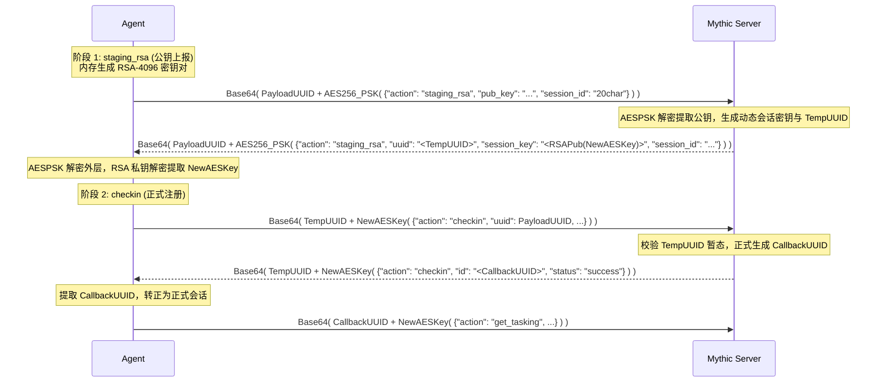

- [Mythic 4.0 核心笔记：受控端初始注册（Initial Checkin）](#mythic-40-核心笔记受控端初始注册initial-checkin)
  - [一、 核心标识符定义与报文解帧](#一-核心标识符定义与报文解帧)
    - [1. 三类核心 UUID 的职责划分](#1-三类核心-uuid-的职责划分)
    - [2. 状态消歧标注（Clarifiers）](#2-状态消歧标注clarifiers)
  - [二、 网络拓扑与 UUID 编码规范](#二-网络拓扑与-uuid-编码规范)
    - [1. 两类受控端拓扑角色](#1-两类受控端拓扑角色)
    - [2. 编码格式约束](#2-编码格式约束)
  - [三、 会话重入与幂等性（二次及多次 Checkin）](#三-会话重入与幂等性二次及多次-checkin)
    - [1. 服务端处理逻辑](#1-服务端处理逻辑)
    - [2. 关键约束](#2-关键约束)
    - [3. 适用场景](#3-适用场景)
  - [四、 模式一：明文签到（Plaintext Checkin）](#四-模式一明文签到plaintext-checkin)
    - [1. 机制与格式](#1-机制与格式)
    - [2. `integrity_level` 权限标量解析](#2-integrity_level-权限标量解析)
    - [3. 明文签到的工程适用场景](#3-明文签到的工程适用场景)
  - [五、 模式二：静态对称加密签到（Static Encryption Checkin）](#五-模式二静态对称加密签到static-encryption-checkin)
    - [1. 机制与格式](#1-机制与格式-1)
    - [2. AES256 加密规格参数](#2-aes256-加密规格参数)
  - [六、 模式三：动态加密密钥交换签到（Encrypted Key Exchange / RSA EKE）](#六-模式三动态加密密钥交换签到encrypted-key-exchange--rsa-eke)
    - [1. 核心流程与两阶段时序](#1-核心流程与两阶段时序)
      - [阶段 1：密钥协商（`staging_rsa`）](#阶段-1密钥协商staging_rsa)
      - [阶段 2：正式注册（`checkin`）](#阶段-2正式注册checkin)
    - [2. 混合加密设计（Hybrid Cryptosystem）的安全意图](#2-混合加密设计hybrid-cryptosystem的安全意图)
    - [3. 密码学技术参数](#3-密码学技术参数)
  - [七、 协议解耦扩展：协议转换容器（Translation Container）](#七-协议解耦扩展协议转换容器translation-container)
    - [1. 默认通信机制的缺陷](#1-默认通信机制的缺陷)
    - [2. 架构位置与通信基础设施](#2-架构位置与通信基础设施)
  - [八、 核心状态跃迁全景总结（UUID 状态机对比）](#八-核心状态跃迁全景总结uuid-状态机对比)
    - [1. 状态机对比表](#1-状态机对比表)
    - [2. 状态跃迁三个阶段（PayloadUUID $\\rightarrow$ CallbackUUID）](#2-状态跃迁三个阶段payloaduuid-rightarrow-callbackuuid)
    - [3. 核心状态约束准则](#3-核心状态约束准则)


# Mythic 4.0 核心笔记：受控端初始注册（Initial Checkin）

---

## 一、 核心标识符定义与报文解帧

### 1. 三类核心 UUID 的职责划分
* **`PayloadUUID`**：作为外层 UUID 时，指示 Mythic 检索该载荷配置及关联的 C2 Profile，获取构建期静态预共享密钥 `AESPSK` 解密报文。
* **`TempUUID`**：作为外层 UUID 时，指示 Mythic 当前处于暂态密钥协商（Staging）流程，检索 Staging 临时数据库获取会话上下文（如客户端 RSA 公钥、Diffie-Hellman 参数）。
* **`CallbackUUID`**：作为外层 UUID 时，指示 Mythic 当前为已完成注册的持久化会话，使用已建立的会话密钥或明文直接处理任务调度。

### 2. 状态消歧标注（Clarifiers）
受控端刚启动时仅持有 `PayloadUUID`，尚未取得 `CallbackUUID`。Checkin 的核心目标就是完成从 `PayloadUUID` 到 `CallbackUUID` 的状态跃迁。在线缆报文伪代码中，通过前缀限定词消除二义性：
```text
Base64( PayloadUUID + EncryptedData )  // Clarifier: 明确限定为载荷构建期 UUID
Base64( TempUUID + EncryptedData )     // Clarifier: 明确限定为协商暂态 UUID
Base64( CallbackUUID + EncryptedData ) // Clarifier: 明确限定为已建连会话 UUID
```

---

## 二、 网络拓扑与 UUID 编码规范

> *"In egress agent messages, you can opt for a 16 Byte big endian format for the UUID. If Mythic gets a message from an agent with this format of UUID, then it will respond with the same format for the UUID. However, currently for P2P messages Mythic doesn’t track the format for the UUID of the agent, so these will get the standard 36 character long UUID String."*

### 1. 两类受控端拓扑角色
* **Egress Agent（出口受控端 / 直接出网节点）**：
  * 运行于具备直接外网访问权限的主机上。
  * 通过出站传输协议（如 HTTP、HTTPS、WebSocket、DNS 等 Egress C2 Profiles）直连位于互联网或边界网络的 Mythic 监听器（`/agent_message`）。
  * 该节点直接发送到服务端的报文即为 `egress agent messages`。
* **P2P Agent（点对点内网受控端 / 隔离节点）**：
  * 运行于隔离内网（Air-Gapped / Deep DMZ）、无直接出网权限的主机上。
  * 依靠横向移动通信协议（SMB 命名管道、内网原始 TCP 等 P2P C2 Profiles）级联至相邻节点，最终汇聚至某个 Egress Agent。
  * 报文嵌套序列化于 Egress Agent 报文的 `delegates` 数组字段中，由 Egress Agent 作为网络中继代理（Pivot Relay）代为向外发送。

### 2. 编码格式约束
* **Egress 报文**：支持将外层 UUID 优化为 **16 字节大端序（Big-Endian）二进制格式**，服务端接收后会自适应以相同二进制格式响应。
* **P2P 报文**：服务端不持久化追踪多跳节点的二进制偏好，回包统一回退为标准的 **36 字符 ASCII UUID 字符串**。

---

## 三、 会话重入与幂等性（二次及多次 Checkin）

> *"If your already existing callback sends a checkin message more than once, Mythic simply uses that information to update information about the callback rather than trying to register a new callback."*

### 1. 服务端处理逻辑
已经成功完成初次注册、已持有 `CallbackUUID` 的受控端（Existing Callback），在后续通信过程中再次向服务端发送了 `action: "checkin"` 结构体时（更新阶段 / UPDATE）：
1. 服务端根据头部 `CallbackUUID` 在数据库的 `callback` 表中命中已有记录。
2. 服务端不会再次触发新会话创建流程（避免生成重复的冗余节点），而是将操作降级为对现有会话的 **`UPDATE`** 操作。
3. 服务端将报文中携带的动态元数据字段（如 `user`、`host`、`pid`、`process_name`、`integrity_level`、`ips` 等）覆盖写入当前记录。
4. 响应报文中返回的 `"id"` 字段保持原本的 `CallbackUUID` 不变，会话加密密钥保持不变。

### 2. 关键约束
在受控端完成初次 Checkin 并取得 `CallbackUUID` 后，**后续所有报文（包括二次发送的 Checkin 报文）的外层定长前缀必须使用原本分配的 `CallbackUUID`，绝对不能再使用 `PayloadUUID`**。

### 3. 适用场景
1. **进程迁移与权限提升**：
   * 当 Agent 通过内存注入（Memory Injection）迁移至新的目标进程，或成功利用本地提权漏洞获取特权上下文后，主机的执行实体发生变化（例如 `pid`、`process_name` 改变，`integrity_level` 由普通用户提升至 SYSTEM / root）。
   * Agent 无需切断当前会话或重新进行复杂的完整握手，只需沿用现有的 `CallbackUUID` 与对称会话密钥，发送一个更新后的 `checkin` 结构体，Mythic 服务端与 UI 操作台即可实时刷新该 Callback 的进程归属与完整性等级。
2. **网络接口与拓扑变更（Network Interface Synchronization）**：
   * 目标主机发生网络拓扑改变（例如接入新网段、建立虚拟网卡、内网 IP 地址动态变更），Agent 重新枚举网卡后，通过再次发送 `checkin` 报文将最新的 `ips` 数组同步至服务端，以便平台更新网络拓扑与代理路由。
3. **通信协议的幂等性保证（Idempotency）**：
   * 在高延迟或不稳定的 C2 链路上，若 Agent 内部异常恢复触发了状态重置，或者在不确定上一轮握手是否完全被服务端持久化的情况下重新提交 Checkin，服务端提供幂等处理能力，确保多次重试不会导致服务端数据库膨胀或生成僵尸回调（Ghost Callbacks）。

---

## 四、 模式一：明文签到（Plaintext Checkin）

### 1. 机制与格式
明文签到在测试阶段或初次构建受控端时非常有用。在创建 Payload 时，C2 Profile 会定义一个带有 `crypto_type=True` 属性的参数（例如在 `http` profile 中为 `aes256_hmac` 或 `none` 的 `ChooseOne` 选项）。若进行明文通信，必须将其设置为 `none`。Mythic 检查外层 `PayloadUUID`，若数据库中无关联加密密钥，则跳过解密直接读取明文。

* **请求报文格式**：
  ```json
  Base64( PayloadUUID + JSON({
      "action": "checkin",                // 必需
      "uuid": "payload uuid",             // 载荷 UUID，必需
      "ips": ["127.0.0.1"],              // 内网 IP 数组，可选
      "os": "macOS 10.15",                // 操作系统版本，可选
      "user": "its-a-feature",            // 当前用户名，可选
      "host": "spooky.local",             // 主机名，可选
      "pid": 4444,                        // 当前进程 PID，可选
      "architecture": "x64",              // 平台架构，可选
      "domain": "test",                   // 主机域名，可选
      "integrity_level": 3,               // 进程完整性级别，可选
      "external_ip": "8.8.8.8",           // 外网 IP，可选
      "encryption_key": "base64 of key",  // 加密密钥，可选
      "decryption_key": "base64 of key",  // 解密密钥，可选
      "process_name": "osascript"         // 当前进程名称，可选
  }))
  ```
  *(注：内层 JSON 完全未经加密，全部为明文)*
* **明文请求 Wire 示例**：
  ```text
  ODA4NDRkMTktOWJmYy00N2Y5LWI5YWYtYzZiOTE0NGMwZmRjeyJhY3Rpb24iOiJjaGVja2luIiwiaXBzIjpbIjE3Mi4xNi4xLjEiLCIxOTIuMTY4LjAuMTE4IiwiMTkyLjE2OC4yMjguMCIsIjE5Mi4xNjguNTMuMSIsIjE5OC4xOS4yNDkuMyIsImZkMDc6YjUxYTpjYzY2OjA6YTYxNzpkYjVlOmFiNzplOWYxIiwiZmQ1MzpkYTlmOjk4MWE6NWI0Mjo4YjA6MzNjOTplMGE1OjIyNTYiLCJmZTgwOjoxIiwiZmU4MDo6MTQ3ZDpkYWZmOmZlZWM6YjQ2NCIsImZlODA6OjE0N2Q6ZGFmZjpmZWVjOmI0NjUiLCJmZTgwOjoxNDdkOmRhZmY6ZmVlYzpiNDY2IiwiZmU4MDo6MTQ3ZDpkYWZmOmZlZWM6YjQ2NyIsImZlODA6OjIyOmQxYzk6MWMyZTo5Mjk3IiwiZmU4MDo6MzQ3ZDpkYWZmOmZlY2U6M2ExNyIsImZlODA6OjNjMmQ6ODZiYjo4ZDk5OjJjNjciLCJmZTgwOjo4ODU3OjJhZmY6ZmU2NToyNTExIiwiZmU4MDo6ODg1NzoyYWZmOmZlNjU6MjUxMSIsImZlODA6OmFlZGU6NDhmZjpmZTAwOjExMjIiLCJmZTgwOjpjZTgxOmIxYzpiZDJjOjY5ZSIsImZlODA6OmQxMDM6N2IyNDo2YzliOjhlMjIiXSwib3MiOiJWZXJzaW9uIDEzLjQgKEJ1aWxkIDIyRjY2KSIsInVzZXIiOiJpdHNhZmVhdHVyZSIsImhvc3QiOiJzcG9va3kubG9jYWwiLCJwaWQiOjY1ODYsInV1aWQiOiI4MDg0NGQxOS05YmZjLTQ3ZjktYjlhZi1jNmI5MTQ0YzBmZGMiLCJhcmNoaXRlY3R1cmUiOiJhbWQ2NCIsImRvbWFpbiI6IiIsImludGVncml0eV9sZXZlbCI6MiwiZXh0ZXJuYWxfaXAiOiIiLCJwcm9jZXNzX25hbWUiOiIvVXNlcnMvaXRzYWZlYXR1cmUvRG9jdW1lbnRzL015dGhpY0FnZW50cy9wb3NlaWRvbi9QYXlsb2FkX1R5cGUvcG9zZWlkb24vcG9zZWlkb24vYWdlbnRfY29kZS9wb3NlaWRvbl93ZWJzb2NrZXRfaHR0cC5iaW4ifQ==
  ```
* **响应报文格式**：
  ```json
  Base64( PayloadUUID + JSON({
      "action": "checkin",
      "id": "UUID", // 分配给 Agent 后续使用的 CallbackUUID
      "status": "success"
  }))
  ```

### 2. `integrity_level` 权限标量解析
代表 Agent 在目标设备上的权限级别（取值 `1 ~ 4` 的整型标量）：
* **Windows 体系（强制完整性控制 MIC）**：
  * `1`：Low Integrity（低完整性，沙箱 / AppContainer）
  * `2`：Medium Integrity（中完整性，标准用户态 / UAC 未提权的受限过滤令牌）
  * `3`：High Integrity（高完整性，管理员提权运行）
  * `4`：SYSTEM Integrity（系统完整性，`NT AUTHORITY\SYSTEM` / 核心系统服务）
* **Linux 体系（启发式特权映射）**：
  * `1`：沙箱 / 限制性容器上下文
  * `2`：标准非特权用户（`UID != 0` 且不在 sudoers）
  * `3`：Sudoer 用户（归属于特权组，具备 sudo 提权能力）
  * `4`：Root 根用户（`UID == 0` 或持有完全系统权能）

### 3. 明文签到的工程适用场景
1. **故障域隔离（Fault Domain Isolation）与缺陷快速定界**：
   * 受控端（Agent）与 C2 服务端的通信流水线跨越了多个复杂的系统层级：
     $$\text{Socket I/O} \longrightarrow \text{Base64 解编} \longrightarrow \text{定长切片解帧} \longrightarrow \mathbf{\text{密码学解密}} \longrightarrow \mathbf{\text{HMAC 校验}} \longrightarrow \mathbf{\text{反序列化}} \longrightarrow \text{数据库事务}$$
   * 若在开发初期直接启用动态密钥协商（RSA EKE）或对称加密（AES-CBC-HMAC），一旦无法生成 Callback，由于密文不透明，开发者无法直接判断故障源自：
     * IV 偏移量计算偏差
     * PKCS#7 填充字节异常
     * HMAC 散列不匹配
     * 亦或是底层 JSON 字段名拼写错误（如 `integrity_level` 类型不符）
   * 明文签到的作用：彻底旁路（Bypass）密码学计算管线。开发者可以直接使用网络流量分析工具（Wireshark、Burp Suite、tcpdump）直接查看出站的明文 JSON，将传输与协议序列化逻辑从密码学实现中解耦，迅速完成故障定界。
2. **数据契约与 Schema 强类型校验（Contract Verification）**：
   * Mythic Core 对 Checkin 数据结构有强类型约束（如 `action: "checkin"` 必需，`uuid` 必需，`ips` 必须为字符串数组，`integrity_level` 必须为 1~4 的整型）。
   * 明文模式下，受控端输出的 JSON 字节流在网络边界完全可见。开发者可直接比对受控端代码序列化生成的 JSON 抽象语法树（AST）与 Mythic 的数据库 Schema 定义，验证字段命名、大小写及数据类型是否 100% 满足服务端的反序列化契约。
3. **渐进式软件架构演进（Incremental Staging / MVP）**：
   * 阶段 1（明文 MVP）：验证运行时基础功能——网卡 IP 枚举、主机名/用户名获取、PID 获取、系统架构识别、HTTP 客户端异步轮询循环、状态机由 `PayloadUUID` 到 `CallbackUUID` 的跳转。
   * 阶段 2（加密层叠加）：在阶段 1 验证完全正确的明文逻辑之外，包裹独立的加密与 MAC 校验管线。明文 Checkin 提供了这一渐进演进的基线验证支持。
4. **流量重定向器与中间件调试（Middlebox Diagnostics）**：
   * 在复杂的 C2 基础设施部署中，受控端与 Mythic Core 之间通常部署有反向代理或重定向器（Nginx、Apache、CDN 网关、Domain Fronting 节点）。
   * 明文格式允许运维工程师在重定向器访问日志（Access Logs）中直接验证 HTTP Method、URI、Header 及 Body 转发规则是否发生篡改、丢包或由于反向代理缓冲区配置不当导致的截断。

---

## 五、 模式二：静态对称加密签到（Static Encryption Checkin）

### 1. 机制与格式
该方法在所有通信中使用静态 AES256 密钥，每个创建的载荷密钥均不同。创建 Payload 时通过带有 `crypto_type=True` 的参数触发生成 per-payload 的 `AES256_HMAC` 密钥。构建期间传递给 Agent 的是 32 字节密钥的 Base64 编码版本。

* **请求报文格式**：
  ```json
  Base64( PayloadUUID + AES256(
      JSON({
          "action": "checkin",                // 必需
          "uuid": "payload uuid",             // 必需
          "ips": ["127.0.0.1"],              // 可选
          "os": "macOS 10.15",                // 可选
          "user": "its-a-feature",            // 可选
          "host": "spooky.local",             // 可选
          "pid": 4444,                        // 可选
          "architecture": "x64",              // 可选
          "domain": "test",                   // 可选
          "integrity_level": 3,               // 可选
          "external_ip": "8.8.8.8",           // 可选
          "encryption_key": "base64 of key",  // 可选
          "decryption_key": "base64 of key",  // 可选
          "process_name": "osascript"         // 可选
      })
  ))
  ```
* **响应报文格式**：
  ```json
  Base64( PayloadUUID + AES256(
      JSON({
          "action": "checkin",
          "id": "callbackUUID", // 分配给 Agent 后续使用的 CallbackUUID
          "status": "success"
      })
  ))
  ```

### 2. AES256 加密规格参数
* **填充方式（Padding）**：PKCS#7，分组块大小 16 字节
* **工作模式（Mode）**：CBC
* **初始向量（IV）**：16 字节密码学安全随机数
* **线缆数据封装**：
  $$\text{IV} + \text{Ciphertext} + \text{HMAC}$$
  *(其中 HMAC 为使用相同 AES 密钥针对 $\text{IV} + \text{Ciphertext}$ 计算得出的 SHA256 散列)*

---

## 六、 模式三：动态加密密钥交换签到（Encrypted Key Exchange / RSA EKE）

Mythic 支持客户端生成 RSA 密钥（apfell-jxa 与 poseidon 采用）以及自定义 EKE。

### 1. 核心流程与两阶段时序



#### 阶段 1：密钥协商（`staging_rsa`）
* **Agent 请求**：
  Agent 启动并在内存中生成新的 4096 位 RSA 密钥对，发送协商报文：
  ```json
  Base64( PayloadUUID + AES256(
      JSON({
          "action": "staging_rsa",
          "pub_key": "base64 of public RSA key",
          "session_id": "20char string" // 该回调的唯一会话标识
      })
  ))
  ```
  * **外层 `AES256(...)`**：Agent 发送公钥时，并不是将公钥明文直接暴露在外网，而是将包含公钥的 JSON 结构体用其本地硬编码的 `AESPSK` 进行了对称加密。
  * **服务端接收逻辑**：服务端切片拿到外层的 `PayloadUUID`，去数据库取出对应的 `AESPSK`，将密文解密，从而提取出 Agent 发来的临时 RSA 公钥（`pub_key`）与 `session_id`。
  * **`AESPSK` 生成时机**：`AESPSK`（预共享对称密钥）不是在网络交互中协商生成的，而是在载荷构建期（Build Time）静态生成的。在配置 C2 Profile（如 `http`）并选择 `crypto_type: "aes256_hmac"` 时，Mythic Core 立即生成一个 32 字节（256 位）随机密钥存入 PostgreSQL，并由构建脚本硬编码注入到 Agent 二进制中。在 Agent 发起任何网络 I/O 之前，双方就已同时持有相同的静态 `AESPSK`。
  * 公钥编码支持两种格式：Base64 编码的完整 PEM 格式（含 `-----BEGIN/END-----`），或仅包含块内内容的 Base64 编码数据。
* **Mythic 响应**：
  ```json
  Base64( PayloadUUID + AES256(
      JSON({
          "action": "staging_rsa",
          "uuid": "UUID",                                        // 即 TempUUID，用于后续消息的临时 UUID
          "session_key": Base64( RSAPub( "new aes session key" ) ), // 服务端生成的全新动态对称会话密钥，由 Agent RSA 公钥加密
          "session_id": "same 20 char string back"
      })
  ))
  ```
  * **响应加密属性**：外层响应依然使用与之前相同的初始 `AESPSK` 进行对称加密。然而，内层的 `session_key` 则是使用 Agent 上报的 RSA 公钥加密并进行 Base64 编码的。响应中包含的 `uuid` 并不是最终的回调 UUID，而是一个临时 UUID（`TempUUID`），用于指示下一条报文将使用协商出的新 AES 密钥加密。
  * **Agent 侧解密时序**：
    1. 外层解密：Agent 接收回包后，首先使用本地硬编码的 `AESPSK` 解密外层密文，还原出 JSON 字典。
    2. 内层解密：Agent 从 JSON 中提取 `"session_key"` 字段，调用本地在内存中生成的 RSA 私钥（Private Key）解密该字段，安全取出服务端下发的 `new aes session key`（动态会话密钥）。
    3. 完成握手：后续阶段 2 的正式 Checkin 及其余常规报文，废弃静态 `AESPSK`，全部改用该 `new aes session key` 加密。

#### 阶段 2：正式注册（`checkin`）
Agent 使用新分配的 `TempUUID` 和新协商的动态 AES 密钥发起正式 Checkin：
* **Agent 请求**：
  ```json
  Base64( tempUUID + AES256(
      JSON({
          "action": "checkin",                // 必需
          "uuid": "payload uuid",             // 必需，内层依然填写原始 PayloadUUID
          "ips": ["127.0.0.1"],              // 可选
          "os": "macOS 10.15",                // 可选
          "user": "its-a-feature",            // 可选
          "host": "spooky.local",             // 可选
          "pid": 4444,                        // 可选
          "architecture": "x64",              // 可选
          "domain": "test",                   // 可选
          "integrity_level": 3,               // 可选
          "external_ip": "8.8.8.8",           // 可选
          "encryption_key": "base64 of key",  // 可选
          "decryption_key": "base64 of key",  // 可选
          "process_name": "osascript"         // 可选
      })
  ))
  ```
  * 关键点在于外层使用阶段 1 获得的 `TempUUID`，内层 `uuid` 维持原始 `PayloadUUID`，加密密钥使用协商得到的 AES 密钥。Mythic 据此追踪新消息归属于同一暂态流程并确认信息完整性。
* **Mythic 响应**：
  ```json
  Base64( tempUUID + AES256(
      JSON({
          "action": "checkin",
          "id": "UUID", // 分配给 Agent 后续使用的正式 CallbackUUID
          "status": "success"
      })
  ))
  ```
  * 从此，Agent 报文全面切换为使用正式的 `CallbackUUID`，并持续使用协商好的新 AES 密钥。

### 2. 混合加密设计（Hybrid Cryptosystem）的安全意图
1. **服务端前置鉴权与抗探测（Authentication & Anti-Probing）**：
   若直接采用无凭证非对称握手，互联网上的扫描器向 C2 监听端口发送随机 RSA 公钥，服务端都会被迫分配内存创建 Staging 会话。在外部套用 `AESPSK` 后，只有持有合法构建密钥的 Agent 才能发送合法的加密报文，有效防御针对 C2 接口的未授权探测与垃圾数据灌注。
2. **前向安全性与独立会话隔离（Forward Secrecy & Session Isolation）**：
   如果多台主机运行同一个 Payload 二进制，或者该二进制被蓝队逆向提取出硬编码的静态 `AESPSK`：
   * 逆向人员利用提取出的 `AESPSK` 只能解密最外层的握手数据包；
   * 关键的后续会话密钥（`new aes session key`）由于被客户端仅在内存中临时生成、从不落盘的 RSA 私钥保护，分析人员在网络层依然完全无法解密后续实际的任务分发与执行回执。

### 3. 密码学技术参数
* **AES-256**：PKCS#7 填充（分组 16 字节）、CBC 模式、16 字节随机 IV、尾部追加 SHA256-HMAC（覆盖 IV + Ciphertext）。
* **RSA-4096**：填充标准为 **`PKCS1_OAEP`（SHA-1 摘要）**，模长 4096 位。

---

## 七、 协议解耦扩展：协议转换容器（Translation Container）

### 1. 默认通信机制的缺陷
Mythic Core 默认仅内置了基于 AES-256-CBC 与 HMAC-SHA256 的加密管线，默认规范为 `Base64(UUID + AES-256-CBC-HMAC(JSON))`：
* **载荷特征签名化**：即使存在传输层加密，内层解密后均为固定的 JSON 键名，易受深度流量审计匹配。
* **密码学套件受限**：无法直接使用 ChaCha20-Poly1305、国密 SM4 或自定义二进制协议（Protobuf、MessagePack、纯结构体）。

### 2. 架构位置与通信基础设施
Translation Container 作为一个独立的微服务容器运行，其拓扑位置处于 **C2 通信网络与 Mythic 核心业务调度之间**，让服务端“听懂”受控端的“方言”（传输任意自定义的专有二进制流，核心平台无缝兼容）：
* **微服务低延迟通信**：普通容器使用 RabbitMQ 异步通信，**Translation Container 强制采用 gRPC 与 Mythic Core 同步通信**，确保主数据通路的微秒级低延迟与高吞吐。
* **掌控权转移**：当引入 Translation Container 时，加密密钥的生成算法、密钥长度与加密模式不再由 Mythic Core 硬编码，而是通过 RPC 委托给容器的 **`generate_keys`** 接口进行动态派发，为受控端实现任意复杂度的自研密码学套件和对抗性私有协议提供了完整的微服务解耦支持。

---

## 八、 核心状态跃迁全景总结（UUID 状态机对比）

### 1. 状态机对比表

| 模式 | 跃迁路径 | 握手报文数 | 对称密钥来源 |
| :--- | :--- | :---: | :--- |
| **明文模式** | `PayloadUUID` $\rightarrow$ `CallbackUUID` | 1 | 无加密 |
| **静态加密模式** | `PayloadUUID` $\rightarrow$ `CallbackUUID` | 1 | 构建期固化静态 `AESPSK` |
| **RSA EKE 模式** | `PayloadUUID` $\rightarrow$ `TempUUID` $\rightarrow$ `CallbackUUID` | 2 | 构建期 `AESPSK` 保护握手；运行时协商 `New AES Session Key` |

### 2. 状态跃迁三个阶段（PayloadUUID $\rightarrow$ CallbackUUID）
1. **请求阶段（Pre-Checkin）**：
   * 受控端仅持有构建期注入的静态 `PayloadUUID`。
   * 发送首个 Checkin 报文，报文外层定长前缀使用 `PayloadUUID`。
2. **响应阶段（Checkin Response）**：
   * 服务端在数据库中将该载荷实例化为独立的活跃会话，生成唯一的 `CallbackUUID`。
   * 服务端回包的外层前缀仍然使用 `PayloadUUID`（确保受控端能正常识别/解密），而在内层 JSON 的 `"id"` 字段中承载新生成的 `CallbackUUID`。
   * 这一设计使得 Mythic 能够精确区分：是某个载荷正在尝试创建一个新的回调会话，还是一个基于该载荷已建立的回调会话正在通信。
3. **完成阶段（Post-Checkin）**：
   * 受控端解析响应，提取 `"id"` 字段，将其覆写为本地通信状态变量。
   * 从此，`PayloadUUID` 在该受控端运行时的生命周期正式结束，后续所有出站报文（如 `get_tasking` 任务拉取、`post_response` 执行回传），其外层定长切片统一变更为此 `CallbackUUID`。

### 3. 核心状态约束准则
* **在所有包含 `"action": "checkin"` 的请求报文中，内层 JSON 的 `"uuid"` 字段始终恒定为 `PayloadUUID`**（注：在 EKE 阶段 1 的 `staging_rsa` 动作中，内层本身无 `uuid` 字段）。
* **在不经过 EKE 协商的标准/静态流程中，外层定长切片与内层字段 100% 同构，即内外均为同一个 `PayloadUUID`**。
* **一旦取得 `CallbackUUID`，受控端状态机发生单向转移，后续一切出站交互的外层切片强制变更为 `CallbackUUID`**。